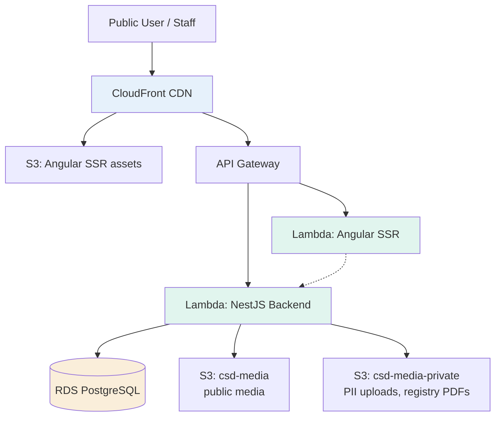
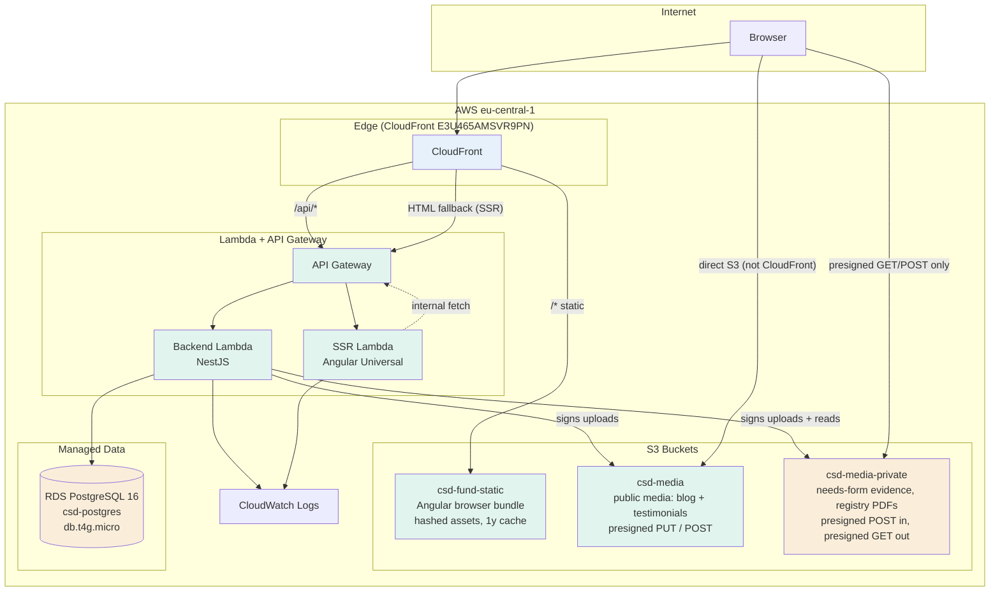

# CSD Fund Web Portal — Architecture & Operations Guide

> **Location:** `docs/ARCHITECTURE.md`
> **Audience:** Primarily developers joining the project. Also useful for CSD fund management, donor compliance reviewers (GIZ, UNICEF), and future open-source contributors.
> **Last updated:** July 2026 (documentation refresh, pass A — see `docs/DOC-AUDIT.md` for the verified inventory this pass was written from)
> **Last verified against code:** 2026-07-29 (commit `1c1030f`)

> **How to read this document.** Every factual claim below was re-derived from the source at the commit above. Where this document and the code disagree, **the code wins** — open the `.ts`/`.yml`/`.json` file and correct this page. Counts (routes, entities, files) drift with every commit; the re-derivation command is given next to each one.

---

## Table of Contents

1. [Introduction](#1-introduction)
2. [Glossary](#2-glossary)
3. [Platform Overview](#3-platform-overview)
4. [Technology Stack](#4-technology-stack)
5. [Repository Structure](#5-repository-structure)
6. [Data Model (ER Diagram)](#6-data-model-er-diagram)
7. [Feature Catalogue](#7-feature-catalogue)
    - 7.1 [Public Website](#71-public-website)
    - 7.2 [Authentication & Authorization](#72-authentication--authorization)
    - 7.3 [WASH Needs Assessment](#73-wash-needs-assessment)
    - 7.4 [Cooperation Modules](#74-cooperation-modules)
    - 7.5 [Admin Panel](#75-admin-panel)
    - 7.6 [Content & Blog](#76-content--blog)
    - 7.7 [Recovery Form](#77-recovery-form)
    - 7.8 [Winterization Form](#78-winterization-form)
    - 7.9 [About Document Registry](#79-about-document-registry)
    - 7.10 [Shared Needs Infrastructure](#710-shared-needs-infrastructure)
8. [Deployment Topology (AWS)](#8-deployment-topology-aws)
    - 8.1 [Media Buckets & Upload Matrix](#81-media-buckets--upload-matrix)
9. [Environment Variables Reference](#9-environment-variables-reference)
10. [Local Development Setup](#10-local-development-setup)
11. [Common Commands](#11-common-commands)
12. [CI/CD & Release Process](#12-cicd--release-process)
    - 12.1 [Pre-merge — PR Checks](#121-pre-merge--githubworkflowstestyml-pr-checks)
    - 12.2 [Post-merge — deploy](#122-post-merge--githubworkflowsdeployyml)
    - 12.3 [Dependency updates](#123-dependency-updates)
13. [Database Migrations](#13-database-migrations)
14. [Security & Vulnerabilities](#14-security--vulnerabilities)
    - 14.1 [Resolved Issues](#141-resolved-issues)
    - 14.2 [Known Unresolved Issues](#142-known-unresolved-issues)
    - 14.3 [Accepted Trade-offs](#143-accepted-trade-offs)
15. [Known Incidents Timeline](#15-known-incidents-timeline)
16. [Runbook — Operational Procedures](#16-runbook--operational-procedures)
17. [Technical Debt](#17-technical-debt)
18. [Contribution Guidelines](#18-contribution-guidelines)
19. [FAQ for New Developers](#19-faq-for-new-developers)

---

## 1. Introduction

The CSD Fund Web Portal (`www.csd-fund.org`) is the public-facing platform and operational system for the Charitable Fund "Centre for Support and Development" — a Ukrainian NGO focused on WASH (Water, Sanitation, Hygiene) recovery, infrastructure reconstruction, and shelter support in regions affected by the war.

The portal serves three distinct user groups:

- **Public visitors** — learn about the fund, read blog posts, consult the governance document registry, apply to vacancies, leave testimonials, file complaints, send general enquiries.
- **Communities & partners** — submit structured needs forms. Three form families exist today: **WASH** (borehole drilling, water towers, purification systems, equipment from a 21-category catalogue), **Recovery** (reconstruction of damaged objects), and **Winterization** (heating, insulation, winter commodities). Recovery and Winterization are anti-spam-gated and accept photo/document evidence.
- **Staff (managers, admins)** — moderate submissions, manage procurements/vacancies, review complaints confidentially, maintain the About document registry, manage user roles.

The project is built, maintained, and deployed by a small team on a tight budget (~$20–30/month AWS footprint).

---

## 2. Glossary

| Term | Meaning |
|------|---------|
| **BOQ** | Bill of Quantities — itemized list of materials/works in procurement |
| **CSD** | Charitable Fund "Centre for Support and Development" (the NGO running this portal) |
| **CSP** | Content Security Policy — HTTP header that restricts what resources a page can load |
| **GIZ** | Deutsche Gesellschaft für Internationale Zusammenarbeit — German development agency (donor) |
| **IOM** | International Organization for Migration — UN agency (potential donor) |
| **ITB** | Invitation to Bid — a formal tender method (synonymous with open tender) |
| **LDS** | Latter-day Saint Charities — a donor organization |
| **LTA** | Long-Term Agreement — UNICEF's framework agreements listing pre-qualified suppliers and equipment |
| **PII** | Personally Identifiable Information (phone, email, full name) |
| **RFP** | Request for Proposals — procurement method for complex services where the approach matters |
| **RFQ** | Request for Quotation — procurement method for simple goods where price is the main factor |
| **SSR** | Server-Side Rendering (Angular Universal) |
| **TOR** | Terms of Reference — scope-of-works document attached to a procurement |
| **UHF** | Ukraine Humanitarian Fund — pooled fund managed by OCHA (donor) |
| **UNICEF** | United Nations Children's Fund (donor) |
| **WASH** | Water, Sanitation, and Hygiene — humanitarian infrastructure sector |

---

## 3. Platform Overview

### High-level architecture



`S3` above is the **Angular browser bundle** bucket (`csd-fund-static`) — it holds no user uploads. User media lives in two separate buckets; see [§8.1](#81-media-buckets--upload-matrix).

### Request flow

1. User visits `https://www.csd-fund.org/some/page`
2. CloudFront (`E3U465AMSVR9PN`) serves the matching asset: static files from S3, API calls proxied to API Gateway, HTML page rendered by the SSR Lambda.
3. SSR Lambda calls the backend Lambda (same API Gateway) to fetch data needed for initial render.
4. Backend Lambda connects to RDS PostgreSQL, processes the request, returns JSON.
5. Hydration happens in the browser; subsequent navigation is client-side.

### Key design decisions

- **Monorepo with two apps** (`backend/`, `ui/`) sharing one git workflow.
- **Serverless all the way** — no EC2, no ECS, no Kubernetes. Lambda cold starts are the trade-off.
- **PostgreSQL + TypeORM** — single database, no microservices, no message queues (intentional simplicity for a small team).
- **SSR for SEO** — blog posts, vacancies, and procurements must be indexable by Google.
- **Bilingual by default** — every entity has both UA and EN fields, language switcher routes through the whole app.

---

## 4. Technology Stack

### Backend (`backend/`)

| Layer | Technology | Version |
|-------|-----------|---------|
| Runtime | Node.js | 22.x (CI pins `22.17.0`) |
| Language | TypeScript | 5.7.x |
| Framework | NestJS | 11.x |
| Database (prod) | PostgreSQL on RDS `csd-postgres` | **16.13** † |
| Database (local dev) | PostgreSQL — Homebrew `postgresql@14` on port 5432 (the `.env.example` default), or Docker `postgres:16` mapped to host 5433 | **14.x** |
| Database (e2e) | Testcontainers `postgres:16-alpine`, started by `backend/test/setup-pg.ts` | 16.x |
| ORM | TypeORM | 0.3.28 |
| Auth | `@nestjs/jwt` + `passport` + `passport-jwt` + `passport-local` | 11.x / 0.7.x / 4.x / 1.x |
| Password hashing | `bcrypt` (login compare + registration; super-admin seed uses 12 rounds) | 6.x |
| Security headers | `helmet` (applied in both `main.ts` and `lambda.ts` via `common/security-headers.ts`) | 8.x |
| Validation | `class-validator` + `class-transformer` | 0.15.x / 0.5.x |
| Sanitization | `sanitize-html` | 2.17.x |
| Lambda adapter | `@codegenie/serverless-express` | 4.17.x |
| Reports | `exceljs` (XLSX), manual CSV with UTF-8 BOM | 4.x |
| Anti-spam | Cloudflare Turnstile, verified server-side by `common/guards/turnstile.guard.ts` | — |
| Deployment | Serverless Framework | v4 |
| Testing | Jest (unit) + Testcontainers (e2e, real PostgreSQL) | Jest 30.x / testcontainers 12.x |
| Linting | ESLint (flat config) + Prettier | ESLint 9 |

† **Not derivable from this repo.** Nothing in `backend/serverless.yml` manages or records the RDS instance; the version and instance class come from `aws rds describe-db-instances`, verified 2026-07-29. Re-check with the CLI rather than trusting this table.

> **Dev/prod major-version skew is real and deliberate-by-omission:** migrations are authored and tested against PostgreSQL **14** locally, exercised against **16** in e2e, and applied to **16.13** in production. Usually benign; see [§13](#13-database-migrations).

### Frontend (`ui/`)

| Layer | Technology | Version |
|-------|-----------|---------|
| Framework | Angular (standalone + signals) | 21.2.x |
| Language | TypeScript | 5.9.x |
| SSR | `@angular/ssr` (with `provideClientHydration(withEventReplay())`) | 21.2.x |
| HTTP entry (Lambda) | `serverless-http` wrapping the SSR Express app (`ui/lambda.mjs`) | 4.x |
| Rich text | `ngx-quill` + Quill 2 | 30.0.x / 2.0.x |
| i18n | `@ngx-translate/core` + `@ngx-translate/http-loader` (fallback `ua`) | 17.x |
| Maps | Leaflet + `leaflet.markercluster` (Activity map) | — |
| Icons | `lucide-angular` | 1.x |
| Builder | `@angular/build:application` (esbuild-based) | 21.2.x |
| Test runner | Vitest (via `ng test` → `@angular/build:unit-test`) | 4.x |
| Linting | `angular-eslint` + `typescript-eslint` + Prettier | ESLint 10 / angular-eslint 21.3.x |

### Infrastructure

| Service | Purpose |
|---------|---------|
| AWS Lambda | Backend runtime + SSR runtime |
| AWS API Gateway | HTTP entry point for both Lambdas |
| AWS RDS | PostgreSQL 16.13, db.t4g.micro † |
| AWS S3 | Three buckets: `csd-fund-static` (Angular bundle), `csd-media` (public media), `csd-media-private` (PII uploads + registry PDFs) — see [§8.1](#81-media-buckets--upload-matrix) |
| AWS CloudFront | CDN, TLS termination, SPA fallback, security-headers policy |
| AWS IAM | Role-based access for Lambdas and deploy pipeline |
| GitHub Actions | Two workflows: `test.yml` (PR Checks, pre-merge, **backend only**) and `deploy.yml` (post-merge deploy). See [§12](#12-cicd--release-process) |

---

## 5. Repository Structure

> **Abridged on purpose.** The tree below shows the files that carry architectural meaning. It omits config dotfiles (`.nvmrc`, `.prettierrc`, `.prettierignore`), the two app-level READMEs (`backend/README.md`, `ui/README.md`), `ui/public/`, `ui/tsconfig.{app,spec}.json`, and most of `docs/` — which also holds `MEDIA-UPLOADS.md`, `AUDIT_PLAN.md`, `audit/`, and several **gitignored** working directories (`forms/`, `about-documents/`, `screenshots/`). Run `ls` before assuming something does not exist; do not cite the gitignored directories from a tracked document, since a fresh clone will not have them.

```
csd-fund/
├── README.md                    # High-level intro + link to this doc
├── CLAUDE.md                    # Repo-wide rules for AI-assisted work
├── CONTRIBUTING.md              # Contribution workflow & PR conventions
├── docs/
│   ├── ARCHITECTURE.md          # This file
│   ├── DOC-AUDIT.md             # Verified code inventory driving the doc refresh
│   ├── MEDIA-UPLOADS.md         # Bucket/endpoint reference (see also §8.1 here)
│   ├── tasks/                   # Task briefs (doc-refresh-task.md, tasks.md)
│   └── …                        # plus gitignored working dirs — see the note above
├── infra/                       # Infra config not owned by Serverless (applied MANUALLY)
│   ├── SECURITY-HEADERS.md      # CloudFront security-headers rationale + enforce procedure
│   ├── cloudfront-response-headers-policy.json  # ⚠ contains an update NOT yet applied to AWS
│   ├── s3-csd-media-cors.json           # CORS for csd-media        (GET, PUT, POST)
│   └── s3-csd-media-private-cors.json   # CORS for csd-media-private (GET, POST)
├── .github/
│   ├── CODEOWNERS               # @Kirnadz is default reviewer
│   ├── dependabot.yml           # weekly grouped bumps; ALL majors ignored; sanitize-html pinned
│   └── workflows/
│       ├── test.yml             # "PR Checks" — pre-merge gate (backend only)
│       └── deploy.yml           # post-merge deploy (both apps)
├── backend/
│   ├── lambda.ts                # ⚠ AWS Lambda handler (sits at backend ROOT, not in src/)
│   ├── serverless.yml           # Serverless Framework v4 config
│   ├── CLAUDE.md
│   ├── eslint.config.mjs
│   ├── nest-cli.json
│   ├── package.json
│   ├── tsconfig.json
│   ├── tsconfig.build.json
│   ├── tsconfig.spec.json       # used by the e2e ts-jest transform
│   ├── scripts/
│   │   ├── check-cjs-load.cjs                   # `npm run check:cjs` — Lambda cold-start guard
│   │   └── verify-baseline-against-prod-schema.ts  # read-only prod schema diff
│   ├── test/                    # e2e only — NOT covered by `npm test` (rootDir is src/)
│   │   ├── jest-e2e.json        # tracked via a `!` negation in backend/.gitignore
│   │   ├── setup-pg.ts          # Testcontainers postgres:16-alpine + runs all migrations
│   │   ├── teardown-pg.ts
│   │   ├── setup-env.ts
│   │   ├── test-app.factory.ts  # mirrors main.ts bootstrap (prefix + ValidationPipe)
│   │   ├── factories/user.factory.ts
│   │   └── app.e2e-spec.ts
│   └── src/
│       ├── app.module.ts        # Root module (TypeOrmModule.forRootAsync + all feature modules)
│       ├── app.controller.ts    # GET / and GET /health (smoke-tested by CI)
│       ├── main.ts              # Local bootstrap; also calls runSeeds() on startup
│       ├── common/
│       │   ├── assert-required-env.ts    # fail-fast boot check (JWT_SECRET ≥32, FRONTEND_URL in prod)
│       │   ├── frontend-urls.ts          # shared CORS allowlist parser, used by main.ts AND lambda.ts
│       │   ├── security-headers.ts       # helmet config, applied by both entry points
│       │   ├── guards/turnstile.guard.ts # Cloudflare Turnstile, reads the x-turnstile-token header
│       │   └── pipes/sanitize-html.pipe.ts   # ⚠ applied by only 2 controllers — see §14.2
│       ├── database/
│       │   ├── data-source.ts            # TypeORM CLI datasource (standalone for migrations)
│       │   ├── migrations/               # All TypeORM migration files
│       │   ├── run-seeds.ts              # Bootstrap chain: equipment catalog THEN about documents
│       │   ├── run-seeds-standalone.ts   # equipment only; no npm script references it (dead code)
│       │   ├── seed-equipment.ts
│       │   ├── seed-about-documents.ts   # 32 register entries, INSERT … ON CONFLICT (code) DO UPDATE
│       │   ├── seed-about-documents-standalone.ts  # `npm run seed:about-documents` — the prod path
│       │   └── seed-super-admin.ts       # MANUAL one-shot script; not in bootstrap chain
│       └── modules/             # 15 feature modules (mount in parens where ≠ folder name)
│           ├── auth/            # /api/auth
│           ├── about/           # /api/about — sections; /api/about/documents — the registry
│           ├── blog/            # /api/blog
│           ├── complaint/       # /api/complaints (plural)
│           ├── content/         # /api/pages
│           ├── cooperation/     # /api/cooperation — umbrella metadata
│           ├── equipment-catalog/   # /api/equipment-catalog
│           ├── inquiry/         # /api/inquiries — general contact-form submissions
│           ├── needs/           # /api/needs-forms — WASH + Recovery + Winterization (27 routes)
│           ├── partners/        # /api/partners
│           ├── procurement/     # /api/procurement
│           ├── testimonial/     # /api/testimonials (plural)
│           ├── upload/          # /api/upload — FOUR endpoints, two buckets (see §8.1)
│           ├── users/           # /api/users
│           └── vacancy/         # /api/vacancies (plural)
├── ui/
│   ├── lambda.mjs               # SSR Lambda entry — serverless-http wrapping app from server.ts
│   ├── ssr-lambda.mjs           # Legacy alt entry — not referenced by serverless.yml (orphaned)
│   ├── serverless.yml
│   ├── angular.json
│   ├── CLAUDE.md
│   ├── eslint.config.mjs
│   ├── package.json
│   └── src/
│       ├── main.ts              # Browser entry
│       ├── main.server.ts       # SSR bootstrap
│       ├── server.ts            # Express app for SSR; exports { app, reqHandler }
│       ├── styles.scss
│       ├── environments/{environment,environment.prod}.ts
│       ├── app/
│       │   ├── app.ts
│       │   ├── app.config.ts            # Browser providers (router, http+interceptor, hydration, i18n)
│       │   ├── app.config.server.ts     # SSR providers (mergeApplicationConfig + withRoutes)
│       │   ├── app.routes.ts            # Public routes
│       │   ├── app.routes.server.ts     # Per-route render mode (blog/:slug=Server, activity-map=Client)
│       │   ├── core/
│       │   │   ├── guards/      # managerGuard, adminGuard, superAdminGuard, authGuard
│       │   │   ├── interceptors/  # auth.interceptor (JWT injection, SSR-safe)
│       │   │   └── services/    # api.service (prepends /api), auth.service (signal-based),
│       │   │                  # language.service (signal wrapper over ngx-translate),
│       │   │                  # page-title.service
│       │   ├── features/        # Lazy-loaded feature components (14 public folders)
│       │   │   ├── home/
│       │   │   ├── about/              # about-shell + overview + documents/ (the registry)
│       │   │   ├── blog/
│       │   │   ├── activity-map/        # Leaflet + marker clustering, signal-driven filters
│       │   │   ├── cooperation/{procurement,vacancy,testimonial,complaint}/
│       │   │   ├── needs/{wash-form,recovery-form,winterization-form}/
│       │   │   ├── admin/               # managerGuard at root; sub-routes use adminGuard / superAdminGuard
│       │   │   ├── partners/            # ⚠ FROZEN — route commented out in app.routes.ts
│       │   │   ├── login/ register/ forgot-password/ reset-password/
│       │   │   ├── not-found/           # served by the `**` route
│       │   │   └── contact/
│       │   ├── layout/          # header, footer
│       │   └── shared/           # components/ (carousel, location-selector, sticky-cta,
│       │                         #   file-upload, form-stepper, turnstile)
│       │                         # pipes/quill-html.pipe.ts · config/quill.config.ts
│       │                         # directives/ · interfaces/ · services/
│       └── assets/
│           ├── data/locations.json  # 29,708 Ukrainian settlements (frontend asset, not DB-seeded)
│           ├── data/activities.json # Activity-map data
│           ├── i18n/{en,ua}.json
│           └── images/
└── convertors/                   # Python utilities, run MANUALLY; output feeds ui/src/assets/data/
    ├── README.md
    ├── convert-locations.py      # rebuilds locations.json from source data
    ├── convert-activities.py     # rebuilds activities.json
    └── csd_activity_map.csv      # source data for convert-activities.py
```

---

## 6. Data Model (ER Diagram)

```mermaid
erDiagram
    USER ||--o{ PROCUREMENT : "creates (SET NULL)"
    USER ||--o{ VACANCY : "creates (SET NULL)"
    USER ||--o{ POST : "authors"
    USER ||--o{ TESTIMONIAL : "submits (optional)"
    USER ||--o{ WASH_FORM_AUDIT_LOG : "changed by (optional)"
    USER ||--o{ NEEDS_FORM_AUDIT_LOG : "changed by (SET NULL, NULL for public submits)"

    WASH_FORM ||--o{ WASH_FORM_ITEM : "contains"
    WASH_FORM ||--o{ WASH_FORM_BOREHOLE : "has many"
    WASH_FORM ||--o{ WASH_FORM_TOWER : "has many"
    WASH_FORM ||--o{ WASH_FORM_PURIFICATION : "has many"
    WASH_FORM ||--o{ WASH_FORM_PUMP : "has many"
    WASH_FORM ||--o{ WASH_FORM_AUDIT_LOG : "audited by"
    WASH_FORM_ITEM }o--|| EQUIPMENT_ITEM : "references (RESTRICT)"

    EQUIPMENT_CATEGORY ||--o{ EQUIPMENT_ITEM : "groups"

    RECOVERY_FORM ||--o{ RECOVERY_FORM_DAMAGE : "contains (CASCADE, eager)"
    WINTERIZATION_FORM ||--o{ WINTERIZATION_FORM_NEED : "contains (CASCADE)"
    RECOVERY_FORM ||..o{ NEEDS_FORM_ATTACHMENT : "polymorphic formType+formId (NO FK)"
    WINTERIZATION_FORM ||..o{ NEEDS_FORM_ATTACHMENT : "polymorphic formType+formId (NO FK)"
    RECOVERY_FORM ||..o{ NEEDS_FORM_AUDIT_LOG : "polymorphic (NO FK — survives deletion)"
    WINTERIZATION_FORM ||..o{ NEEDS_FORM_AUDIT_LOG : "polymorphic (NO FK — survives deletion)"
    FORM_NUMBER_SEQUENCE ||..o{ RECOVERY_FORM : "issues CSD-R-<year>-<0000>"
    FORM_NUMBER_SEQUENCE ||..o{ WINTERIZATION_FORM : "issues CSD-W-<year>-<0000>"

    ABOUT_DOCUMENT ||--o{ ABOUT_DOCUMENT_FILE : "versions per locale (CASCADE)"
    ABOUT_SECTION }o--o{ ABOUT_DOCUMENT : "both render on /about* (no FK)"

    USER {
        uuid id PK
        string email UK
        string passwordHash
        string firstName
        string lastName
        enum role "public|manager|admin|donor|super_admin"
        timestamp createdAt
    }

    POST {
        uuid id PK
        string slug UK
        string titleUa
        string titleEn
        text contentUa
        text contentEn
        text excerptUa
        text excerptEn
        string category "default 'news'"
        string coverImage
        jsonb images "string[]"
        string videoUrl
        boolean isPublished
        boolean isFeatured
        timestamptz publishedAt
        timestamp createdAt
        User author "ManyToOne, eager"
    }

    PARTNER {
        uuid id PK
        string nameUa
        string nameEn
        string logoUrl
        string websiteUrl
    }

    PROCUREMENT {
        uuid id PK
        string tenderTitleUa
        string tenderTitleEn
        string referenceNumber
        enum donor
        enum procurementMethod
        enum procurementCategory
        enum lotStructure
        text shortDescriptionUa
        text shortDescriptionEn
        text detailedDescriptionUa "Quill HTML"
        text detailedDescriptionEn "Quill HTML"
        string region
        jsonb communities
        jsonb technicalDocuments
        jsonb evaluationCriteria
        jsonb attachments
        timestamptz publicationDate
        timestamptz bidSubmissionDeadline
        enum status "draft|published|extended|evaluation|awarded|suspended|cancelled|completed|closed[deprecated]"
        uuid createdById FK
    }

    VACANCY {
        uuid id PK
        string titleUa
        string titleEn
        text descriptionUa "Quill HTML"
        text descriptionEn "Quill HTML"
        text requirementsUa
        text requirementsEn
        enum employmentType "full_time|part_time|volunteer"
        string region
        timestamptz applicationDeadline
        string salary
        enum status "draft|published|extended|on_hold|suspended|cancelled|hired|closed[deprecated]"
        timestamptz publishedAt
        uuid createdById FK
    }

    TESTIMONIAL {
        uuid id PK
        string authorName
        string organization
        text text
        int rating "1-5, nullable"
        string photoUrl
        jsonb photos "TestimonialPhoto[] (max 3)"
        enum assistanceTypes "array, nullable"
        string assistanceTypeOther
        string region
        string regionEn
        string district
        string districtEn
        string community
        string communityEn
        string communityCode
        string settlement
        string settlementEn
        string settlementCode
        boolean isVerified
        enum status "pending|approved|rejected"
        timestamptz publishedAt
        text managerNotes
        uuid createdById FK "col created_by_id, SET NULL"
        timestamp createdAt
    }

    COMPLAINT {
        uuid id PK
        enum category "service_quality|staff_behavior|corruption|delay|other"
        text description
        string phone
        string email
        string region
        string regionEn
        string district
        string districtEn
        string community
        string communityEn
        string communityCode
        string settlement
        string settlementEn
        string settlementCode
        jsonb attachments
        text expectedResolution
        enum status "new|in_review|resolved|closed"
        timestamptz submittedAt
        text managerNotes
        timestamp createdAt
    }

    WASH_FORM {
        uuid id PK
        string region
        string regionEn
        string district
        string districtEn
        string community
        string communityEn
        string communityCode
        string settlement
        string settlementEn
        string settlementCode
        string organizationName
        string headName
        string headPhone
        string email
        string objectName
        int dependentPopulation
        text socialFacilities
        string installationDeadline
        text replacementReason
        enum status "new|in_review|approved|rejected|in_progress|completed"
        text managerNotes
        timestamp createdAt
        timestamp updatedAt
    }

    WASH_FORM_ITEM {
        uuid id PK
        uuid washFormId FK
        uuid equipmentItemId FK
        decimal quantity
        text notes
        int sortOrder
    }

    EQUIPMENT_CATEGORY {
        uuid id PK
        string code UK
        string nameUa
        string nameEn
        int sortOrder
    }

    EQUIPMENT_ITEM {
        uuid id PK
        uuid categoryId FK
        int ltaCode UK
        string nameUa
        string nameEn
        enum unit "pcs|meters|kg"
        text specifications
        int sortOrder
    }

    WASH_FORM_BOREHOLE {
        uuid id PK
        uuid washFormId FK
        enum workType "new_drilling|repair_cleaning|new_near_existing"
        int expectedFlowRate "m3/h"
        boolean hasAquiferInfo
        int existingDepth
        int existingDebit
        boolean hasDesignInfo
        boolean hasPassport
        text oldLocation
        text notes
        int sortOrder
    }

    WASH_FORM_TOWER {
        uuid id PK
        uuid washFormId FK
        enum towerType "vbr_15|vbr_25|vbr_50|vbr_over_50"
        enum towerHeight "8|10|12|15|18|20|25|over_25"
        int customHeight
        boolean hasFoundation
        boolean isFoundationSuitable
        boolean needsFoundationReconstruction
        boolean canSelfReconstruct
        boolean canProvideCrane
        text notes
        int sortOrder
    }

    WASH_FORM_PURIFICATION {
        uuid id PK
        uuid washFormId FK
        boolean hasRoom
        boolean hasTemperatureControl
        boolean hasWaterInletDrainage
        boolean hasPowerSupply
        boolean canMaintainSystem
        boolean willingToProvideWater
        text notes
        int sortOrder
    }

    WASH_FORM_PUMP {
        uuid id PK
        uuid washFormId FK
        enum purpose "borehole|surface|drainage_sewage|other"
        string purposeOther
        string brand
        string model
        decimal powerKw
        decimal flowRateM3h
        decimal headM
        decimal diameterInches
        string voltage
        int phases
        int quantity
        text notes
        int sortOrder
    }

    WASH_FORM_AUDIT_LOG {
        uuid id PK
        uuid washFormId FK
        uuid changedById FK "SET NULL"
        string changedByEmail "snapshot, survives user deletion"
        enum action "created|updated|status_changed|deleted"
        string fieldName
        text oldValue
        text newValue
        jsonb metadata
        timestamp createdAt
    }

    FORM_NUMBER_SEQUENCE {
        string formType PK "'recovery' | 'winterization'"
        int year PK
        int lastValue "default 0; incremented under a row lock"
    }

    NEEDS_FORM_ATTACHMENT {
        uuid id PK
        string formType "'recovery' | 'winterization' — polymorphic, NO FK"
        uuid formId
        string kind "'photo' | 'document' — note: 'doc' is only the S3 sub-directory"
        string s3Key "key in csd-media-private"
        string publicUrl "nullable — unused for private-bucket files"
        string originalName
        string mimeType
        int sizeBytes
        int sortOrder
        timestamp createdAt
    }

    NEEDS_FORM_AUDIT_LOG {
        uuid id PK
        string formType "polymorphic, NO FK to the form"
        uuid formId
        uuid changedById FK "SET NULL; NULL for anonymous public submits"
        string changedByEmail "snapshot, survives user deletion"
        string action "created|updated|status_changed|deleted"
        string fieldName
        text oldValue
        text newValue
        jsonb metadata
        timestamp createdAt
    }

    RECOVERY_FORM {
        uuid id PK
        string trackingNumber UK "CSD-R-<year>-<0000>"
        string region_regionEn_district_communityCode "location block, NOT NULL DEFAULT ''"
        string organizationName
        string contactPosition "NOT NULL (nullable in winterization)"
        text objectType_objectName
        string[] workCategories "text[] NOT NULL"
        text damageDescription "NOT NULL"
        string damageCause_damageCategory_functioningStatus "all NOT NULL"
        int directBeneficiaries_idpCount_childrenCount_pwdCount_elderlyCount "SADD, all NOT NULL"
        decimal estimatedCost "numeric(14,2) NOT NULL — hard requirement"
        string costBasis_cofinancing "NOT NULL"
        string[] docsAvailable "text[] NOT NULL; 'none' must be sent explicitly"
        boolean otherDonors "NOT NULL"
        string urgency "nullable here, NOT NULL in winterization"
        string asbestosPresence "NOT NULL — ECHO environmental screening"
        enum status "needs_form_status_enum, default 'new'"
        timestamp createdAt_updatedAt
    }

    RECOVERY_FORM_DAMAGE {
        uuid id PK
        uuid recoveryFormId FK "CASCADE"
        string element "varchar(30)"
        decimal volume "numeric(12,2), nullable"
        string unit "varchar(10), nullable"
        string notes "varchar(500), nullable"
        int sortOrder
    }

    WINTERIZATION_FORM {
        uuid id PK
        string trackingNumber UK "CSD-W-<year>-<0000>"
        string applicantType "'household' gated by WINTERIZATION_HOUSEHOLD_ENABLED → 422"
        string region_regionEn_district_communityCode "location block"
        string[] needCategories "text[] NOT NULL, GIN-indexed — query with @> ARRAY[...]"
        int directBeneficiaries_idpCount_childrenCount_pwdCount_elderlyCount "SADD"
        decimal estimatedCost "numeric(14,2) NULLABLE by design"
        string costBasis "nullable; required only when a cost is given"
        string urgency "NOT NULL"
        enum status "needs_form_status_enum, default 'new'"
        timestamp createdAt_updatedAt
    }

    WINTERIZATION_FORM_NEED {
        uuid id PK
        uuid winterizationFormId FK "CASCADE"
        string category "varchar(40)"
        string item "varchar(40)"
        decimal quantity "numeric(12,2), nullable"
        string unit "varchar(10), nullable"
        decimal powerKw "numeric(8,2), nullable"
        string fuelType "varchar(20), nullable"
        string purpose "varchar(30), nullable"
        string details "varchar(500), nullable"
        int sortOrder
    }

    INQUIRY {
        uuid id PK
        enum reason "partnership|volunteering|press|general|other"
        string reasonOther
        string name
        string email
        string phone
        enum messengerType "telegram|viber|whatsapp|other"
        string messengerHandle
        enum preferredLang "ua|en"
        text message
        boolean consent
        enum status "new|read|replied|archived"
        text managerNotes
        timestamp createdAt
        timestamp updatedAt
    }

    ABOUT_SECTION {
        uuid id PK
        enum key UK "INTRO|MISSION|VISION|VALUES|DIRECTIONS|KEY_FACTS|RESULTS|TEAM_INTRO|CONTACTS_INTRO|DOCUMENTS_INTRO"
        string titleUa
        string titleEn
        text contentUa "Quill HTML"
        text contentEn "Quill HTML"
        jsonb metadata
        boolean isPublished
        int sortOrder
        timestamp createdAt
        timestamp updatedAt
    }

    ABOUT_DOCUMENT {
        uuid id PK
        string code UK "varchar(32), e.g. CSD-POL-01 — the public identifier used in URLs"
        string titleUa
        string titleEn
        text descriptionUa
        text descriptionEn
        string documentType "varchar(32), NOT a pg enum since PR-D1; 10 values, default POLICY"
        string accessMode "varchar(32): public_download|view_only|on_request, default view_only"
        string legacyFileUrl "renamed from file_url; never in a public payload"
        date lastReviewDate
        date nextReviewDate
        string version
        boolean isPublished "default false"
        int sortOrder
        timestamp createdAt
        timestamp updatedAt
    }

    ABOUT_DOCUMENT_FILE {
        uuid id PK
        uuid documentId FK "CASCADE"
        string locale "varchar(5): ua|en"
        string version "varchar(20), e.g. v1 / v12 — pattern enforced in the DTO"
        date effectiveDate
        string s3Key "varchar(512) in csd-media-private"
        string originalName
        string mimeType "default application/pdf"
        int sizeBytes
        int pageCount
        string checksumSha256
        boolean isCurrent "partial UNIQUE (documentId, locale) WHERE isCurrent"
        timestamp createdAt
        timestamp updatedAt
    }

    COOPERATION {
        uuid id PK
        enum type "vacancy|tender|initiative"
        enum status "open|closed"
        string titleUa
        string titleEn
        text descriptionUa
        text descriptionEn
        text requirementsUa
        text requirementsEn
        string location
        timestamptz deadline
        string contactEmail
        boolean isPublished
        timestamp createdAt
        timestamp updatedAt
    }
```



> The codebase defines **29** `@Entity` classes across **29** `*.entity.ts` files (re-derive with `grep -rc "@Entity(" backend/src --include='*.entity.ts' | wc -l`). The diagram covers all business entities except the standalone CMS `PAGE` entity (`content/entities/page.entity.ts`), which carries no foreign keys. Relation cardinalities and `onDelete` behaviour are noted where they exist in the entity files.

**Reading the needs-form tables.** `recovery_forms` has **74** columns and `winterization_forms` has **80** — far too many to reproduce faithfully here, and any list would rot on the next migration. The blocks above show the identity, location, SADD-beneficiary, budget and status groups plus every column whose nullability is likely to surprise; several related columns are collapsed onto one line (`region_regionEn_district_communityCode`). **The entity files are the authority** — `backend/src/modules/needs/entities/{recovery-form,winterization-form}.entity.ts`, each column carrying a `why` comment.

Three structural decisions worth internalising before touching this area:

- **`needs_form_attachments` and `needs_form_audit_log` are polymorphic and carry no foreign key to the form.** `formType` + `formId` are plain columns. For attachments this keeps one table serving both form families; for the audit log it is deliberate, so `action='deleted'` rows survive the hard delete of the form they describe. TypeORM will not join these for you — the services compose them by hand.
- **`needs_form_status_enum` is created by the *recovery* migration** (`1777800000000-AddRecoveryForms.ts`), together with `form_number_sequences`, `needs_form_attachments` and `needs_form_audit_log`. The winterization migration creates nothing shared and drops nothing shared. Reverting recovery therefore takes winterization's status type with it.
- **WASH keeps its own `wash_form_audit_log`.** It was not migrated onto the shared table — working code was left alone during that epic. Two audit tables coexist by design.

---

## 7. Feature Catalogue

### 7.1 Public Website

- Landing page (`/`) with hero, mission statement, featured blog posts, impact stats (signal-driven service).
- About (`/about`) — a shell with two children: `/about` (CMS-driven bilingual sections) and `/about/documents` (the governance document registry, §7.9). They are **separate API calls**: `GET /api/about` returns sections only.
- Blog (`/blog`, `/blog/:slug`) with Quill-formatted posts in UA/EN; post detail uses a route resolver.
- Activity map (`/activity-map`) — Leaflet map with marker clustering, category sidebar, signal-based filtering; data sourced from `ui/src/assets/data/activities.json`.
- Partners (`/partners`) — ⚠ **FROZEN**: route and header link are commented out until the fund provides partner logos & data. `PartnersComponent` and backend `GET /api/partners` are ready; to re-enable, uncomment the block in `ui/src/app/app.routes.ts` (search "FROZEN") and the matching nav link in `ui/src/app/layout/header/header.ts`.
- Contact page (`/contact`) — general contact form posting to `POST /api/inquiries` (see Inquiries below).
- Public Cooperation pages:
    - Procurement tenders (`/cooperation/procurement`)
    - Vacancies (`/cooperation/vacancy`)
    - Testimonials (`/cooperation/testimonial`)
    - Complaints submission (`/cooperation/complaint`)
- Needs assessment — three forms: `/needs/wash-form` (§7.3), `/needs/recovery-form` (§7.7), `/needs/winterization-form` (§7.8). `/needs` redirects to `wash-form`; `/wash-form` is kept as a legacy redirect.

**Render modes** are declared in `ui/src/app/app.routes.server.ts`, and there are exactly three rules:

| Route | Mode |
|-------|------|
| `blog/:slug` | `RenderMode.Server` |
| `activity-map` | **`RenderMode.Client`** — Leaflet is loaded from the unpkg CDN and needs a real `window` |
| `**` | `RenderMode.Server` |

So *almost* all pages are SSR-rendered for SEO — `activity-map` is the deliberate exception. **Nothing is prerendered**; `RenderMode.Prerender` appears nowhere in the app.

**Language** is initialised to `'ua'` on every bootstrap (`app.ts`: `translate.use('ua')`) and is **not persisted** — no localStorage, no cookie, no URL segment. Every reload and every SSR render resets to Ukrainian; the switcher only changes the current session. Language-dependent *logic* must read `LanguageService` (a signal wrapper), not `translate.currentLang` — the app is zoneless, so the plain getter is not reactive. Roughly 19 files use the service; **35** still read the getter.

### 7.2 Authentication & Authorization

**Auth flow:**
1. Register (`POST /api/auth/register`) — any public user.
2. Login (`POST /api/auth/login`) returns a JWT (HS256, signed with `JWT_SECRET`).
3. JWT stored in `localStorage`; sent as `Authorization: Bearer <token>` via `auth.interceptor.ts`.
4. Forgot password flow via email token (`POST /api/auth/forgot-password`, `POST /api/auth/reset-password`).

**Roles** (hierarchy in practice, not enforced as inheritance):
- `public` — default, no privileges.
- `donor` — reserved for future donor-only views.
- `manager` — can create/edit procurements, vacancies, testimonials (moderate), see WASH forms.
- `admin` — all of the above + complaints.
- `super_admin` — all of the above + user role management.

**Guards** (in `ui/src/app/core/guards/auth.guard.ts`):
- `authGuard` — any authenticated user.
- `managerGuard` — manager, admin, super_admin.
- `adminGuard` — admin, super_admin.
- `superAdminGuard` — super_admin only.

On the backend, `JwtAuthGuard + RolesGuard + @Roles(...)` enforces access per route. Two behaviours of `RolesGuard` (`modules/auth/guards/roles.guard.ts`) matter:

- **`super_admin` bypasses every role list** — it returns `true` before comparing against `@Roles(...)`, so `super_admin` implicitly has access to every guarded route.
- **`@UseGuards(RolesGuard)` without `@Roles(...)` is a no-op** — an absent or empty role list also returns `true`. Adding the guard and forgetting the decorator silently grants access to any authenticated user.

**`TurnstileGuard`** is a third guard, applied to exactly three routes:

| Route | Notes |
|-------|-------|
| `POST /api/needs-forms/recovery` | public submit |
| `POST /api/needs-forms/winterization` | public submit |
| `POST /api/upload/needs-presigned` | public presigned POST into the private bucket |

The token travels in the **`x-turnstile-token` request header**, not the body — the global `ValidationPipe` runs `forbidNonWhitelisted: true`, so a body field would be rejected unless added to every DTO. The header is allowlisted in API Gateway CORS (`backend/serverless.yml`). The guard **fails closed in production**: a missing `TURNSTILE_SECRET_KEY` returns 403; outside production it warns and passes, so local development works without a secret.

Turnstile does **not** cover the other anonymous endpoints (complaints, testimonials, inquiries, WASH submit, `POST /api/upload/testimonial-presigned`). Retrofitting them was deferred; there is no rate limiting either — see §14.2.

There is **no Swagger, no `@nestjs/throttler`, no global exception filter, no global interceptor and no `APP_GUARD`** anywhere in the backend. The only global registrations are `helmet` and the single `ValidationPipe`.

### 7.3 WASH Needs Assessment

A structured 8-step form (`/needs/wash-form`, steps indexed 0–7 in `wash-form.ts`) for communities to submit infrastructure needs. Fields include:

- Organization & contact details.
- Object being restored.
- Dependent population count.
- Location (cascading Region → District → Community → Settlement selector powered by 29,708-row `locations.json`).
- Optional sub-sections: borehole drilling, water tower, purification system.
- Equipment items from a 21-category catalogue (seeded from UNICEF LTA data).
- Status tracking through admin review.

Admin UI lists, filters by status/region, allows detail view, and exports to **XLSX with 6 sheets** — `Forms`, `Boreholes`, `Towers`, `Purifications`, `Pumps`, `Equipment` (`modules/needs/xlsx-export.service.ts`). It is not CSV.

WASH is the oldest of the three needs forms and the only one that is **not** Turnstile-guarded. It also keeps its own `wash_form_audit_log` rather than the shared table introduced with Recovery.

### 7.4 Cooperation Modules

Four sibling modules, all accessible under `/cooperation/*` publicly and `/admin/*` for staff:

| Module | Public list | Status lifecycle | Special features |
|--------|-------------|------------------|------------------|
| Procurement | `/cooperation/procurement` | draft → published → extended → evaluation → awarded → completed (or suspended/cancelled) | 7-step creation form, Quill rich text, evaluation criteria, attachments |
| Vacancy | `/cooperation/vacancy` | draft → published → extended → on_hold → hired (or suspended/cancelled). Legacy `closed` still exists in the PG enum but is `@deprecated` — use `hired`. | Employment types, application deadline tracking |
| Testimonial | `/cooperation/testimonial` | pending → approved (or rejected) | Rating 1-5, verification toggle, moderation flow |
| Complaint | — (private) | new → in_review → resolved → closed | Confidential, anonymous submission, PII toggle in admin, CSV export with UTF-8 BOM |

**Inquiries (general contact channel).** Separate from the four cooperation modules. `InquiryController` (`@Controller('inquiries')` → `/api/inquiries`) accepts public, unauthenticated contact-form submissions via `POST /api/inquiries` (no auth, like complaints). Submitters pick a reason (`partnership`, `volunteering`, `press`, `general`, `other`), a preferred language (`ua`/`en`), and at least one contact method (email / phone / messenger — `telegram`, `viber`, `whatsapp`, `other`). Admin+ endpoints (`admin/list`, `admin/export`, `:id`, `:id/status`, delete) are guarded by `JwtAuthGuard + RolesGuard` (`ADMIN`, `SUPER_ADMIN`); CSV export streams with a UTF-8 BOM. Status lifecycle: new → read → replied → archived.

### 7.5 Admin Panel

Single-page admin shell at `/admin` with:

- Left sidebar with role-based menu items (manager sees subset, admin more, super_admin everything).
- Off-canvas hamburger menu on mobile.
- Sections (from `ui/src/app/features/admin/admin.routes.ts`; `/admin` redirects to `wash-forms`):

| Route | Screen |
|-------|--------|
| `wash-forms`, `wash-forms/:id` | WASH list + detail |
| `recovery-forms`, `recovery-forms/:id` | Recovery list + detail (§7.7) |
| `winterization-forms`, `winterization-forms/:id` | Winterization list + detail (§7.8) |
| `procurements` | Procurement management |
| `vacancies` | Vacancy management |
| `testimonials`, `testimonials/:id/edit` | Testimonial moderation |
| `complaints` | Complaints (admin+) |
| `inquiries` | General enquiries (admin+) |
| `about` | About sections **and** the document registry (§7.9) |
| `users` | Role management (super_admin only) |

- Per-module features: paginated tables, search, filters, inline status change with confirmation, edit links to forms, delete (with hard-delete restrictions — see Section 14.3).
- **Detail screens for the needs forms reuse the public form component** in edit mode rather than duplicating it — see §7.10.
- ⚠ Five admin list components read `localStorage.getItem('token')` **without an `isPlatformBrowser` guard** for their XLSX/CSV `fetch` export (`wash-forms-list`, `recovery-forms-list`, `winterization-forms-list`, `complaints-list`, `inquiries-list`). In practice these only run on click, but the `admin` route is server-rendered via the `**` catch-all, and `ui/CLAUDE.md` states the guard as an invariant. Tracked in §14.2.

### 7.6 Content & Blog

- Blog posts (`/api/blog`) and CMS pages (`/api/pages`) store Quill HTML.
- ⚠ **Neither is sanitized server-side.** `SanitizeHtmlPipe` is applied by exactly two controllers — `vacancy` (create, update, legacy `:id/publish`) and `procurement` (create, update). `:id/status` is unwrapped on both. `blog.controller.ts` and `content.controller.ts` pass their DTOs straight through. About *sections* are sanitized, but by a second, independently-configured `sanitizeHtml()` call inside `about.service.ts` rather than by the pipe. See §14.2.
- All HTML outputs in the UI are rendered through `QuillHtmlPipe` which handles `&nbsp;`, Quill list markers, and safe HTML rendering. Today this Angular-side pass is the **only** control for blog and page content — not defence in depth.

### 7.7 Recovery Form

Reconstruction requests for war-damaged objects. Public form at `/needs/recovery-form`; submit is `POST /api/needs-forms/recovery`.

**Routes** (`modules/needs/needs.controller.ts`, mounted at `/api/needs-forms`):

| Route | Guards |
|-------|--------|
| `POST recovery` | `TurnstileGuard` only — anonymous |
| `GET recovery` · `GET recovery/:id` · `GET recovery/:id/audit-log` | Jwt + Roles(MANAGER, ADMIN) |
| `PATCH recovery/bulk` · `PATCH recovery/:id` · `PATCH recovery/:id/full` | Jwt + Roles(MANAGER, ADMIN) |
| `GET recovery/export-xlsx` | Jwt + Roles(MANAGER, ADMIN) |
| `DELETE recovery/:id` | Jwt + **Roles(ADMIN)** |

> Route-ordering constraint: `recovery/bulk` and `recovery/export-xlsx` must stay registered **before** `recovery/:id`, or Nest matches the literal segments as a UUID param. The controller says so in a comment; keep it.

**Data.** `recovery_forms` (74 columns) + `recovery_form_damages` (7), cascade + eager. Attachments live in the shared polymorphic `needs_form_attachments`.

**Tracking number** `CSD-R-<year>-<0000>`, allocated inside the create transaction by `FormNumberService` off `form_number_sequences` (§7.10).

**Public form: 6 steps** — Applicant · Object · Beneficiaries · Budget · Files · Review. (There is no `totalSteps` field; the steps are an array consumed by the shared `FormStepperComponent`. `totalSteps` exists only in the unrelated procurement form.)

**Attachments.** Photos are **mandatory: 3–10**, ≤5 MB each, `image/jpeg|png|webp`. Documents optional, ≤5, ≤15 MB, PDF/DOCX/XLSX/ZIP. Size and MIME are enforced twice — as S3 POST-policy conditions at presign time and again server-side on submit, which also rejects duplicate S3 keys and keys outside the `media/needs/recovery/` prefix.

**Two things that block applicants, by design:**
- `estimatedCost` is `numeric(14,2) **NOT NULL**` with `@Min(1)` — a community without a кошторис cannot submit. (Winterization deliberately made this nullable; see §7.8.)
- `docsAvailable` is `text[] NOT NULL` — "none" is a value that must be sent explicitly, not an omission.

`asbestosPresence` is also NOT NULL — mandatory ECHO environmental screening.

**Export:** `RecoveryXlsxExportService`, **3 sheets** — `Applications` / `Damages` / `Files` (Ukrainian sheet names when `?lang=ua`). Unpaged: the query builder fetches every matching form.

**Delete is a hard delete and is ungated beyond the role check** — no status precondition, unlike procurement, vacancy and complaint. (Testimonial delete is ungated too; see §14.2.) The form row, its damages (FK cascade) and its attachment rows go; **S3 objects are deliberately left behind**, with their keys recorded in the audit entry. See §14.2.

### 7.8 Winterization Form

Winter-season needs — heating, insulation, commodities. Public form at `/needs/winterization-form`; submit is `POST /api/needs-forms/winterization`.

Route table, guards and delete semantics mirror Recovery exactly (swap `recovery` → `winterization`), including the ADMIN-only ungated hard delete and the `bulk`/`export-xlsx`-before-`:id` ordering rule.

**Data.** `winterization_forms` (80 columns) + `winterization_form_needs` (11). Its migration creates **nothing shared** — it depends on the objects the recovery migration created.

**Tracking number** `CSD-W-<year>-<0000>`. **Public form: 7 steps** — Applicant · Object · Needs · Beneficiaries · Budget · Files · Review.

**Three behaviours that differ from Recovery and are easy to get wrong:**

1. **`needCategories` is `text[]` with a GIN index** — the only GIN index in the schema. The admin filter must use containment:

   ```sql
   "needCategories" @> ARRAY[:needCategory]::text[]
   ```

   `:needCategory = ANY("needCategories")` returns the same rows but **cannot use the index**. The migration and the service both carry this warning; preserve it in any query rewrite.

2. **`estimatedCost` is nullable** — the opposite of Recovery, and intentional: commodity needs are budgeted analyst-side from quantity × cluster reference cost, so a hromada without a кошторис is not blocked. `costBasis` is required only when a cost *is* supplied, and is nulled server-side when it is not.

3. **Household applications are feature-gated.** `applicantType='household'` throws **422 Unprocessable Entity** unless `WINTERIZATION_HOUSEHOLD_ENABLED === 'true'` (strict string compare — `1`, `TRUE`, `yes` do not work; default `'false'` in `serverless.yml`). The gate is checked in **two** places: the public `create()`, and the admin `PATCH /:id/full`, where it is re-evaluated against the *resulting* applicant type so an admin edit cannot smuggle a household application past it. A consequence worth knowing: while the flag is off, an admin cannot save an existing household record either. The quick `PATCH /:id` (status/notes) does not check it, since it never touches `applicantType`. `ui/src/environments/*.ts` carries a separate `winterizationHouseholdEnabled` flag — that one is **UX only**; the backend answers 422 regardless.

**Photos are conditionally required**, not always: ≥3 only when a works category (`heating_system_repair`, `insulation`) is selected. The rule cannot be expressed with `ValidateIf`, so the DTO marks photos optional and the service enforces the minimum. Caps and MIME lists are re-exported from the recovery constants; the S3 prefix is `media/needs/winterization/`.

**Export:** `WinterizationXlsxExportService`, **3 sheets** — `Applications` / `Needs` / `Files`.

### 7.9 About Document Registry

The fund's governance documents (policies, codes, mechanisms) as a browsable register at `/about/documents`, backed by versioned PDFs in the **private** bucket. Seeded with **32 register entries**.

**API — note the split.** `GET /api/about` returns **sections only**; it used to return every document link in one response and that bulk-download vector was deliberately closed.

| Route | Auth | Purpose |
|-------|------|---------|
| `GET /api/about` | public | About-page **sections** only |
| `GET /api/about/documents` | public | Registry listing — carries **no URLs** |
| `GET /api/about/documents/:code/file?locale=ua\|en` | public | One presigned GET, TTL **300 s** |
| `GET/POST/PATCH/DELETE /api/about/admin/sections[/:id]` | Jwt + Roles(ADMIN, SUPER_ADMIN) | Section CRUD |
| `GET/POST/PATCH/DELETE /api/about/admin/documents[/:id]` | Jwt + Roles(ADMIN, SUPER_ADMIN) | Document CRUD |
| `GET/POST /api/about/admin/documents/:id/files` · `GET/DELETE /api/about/admin/files/:fileId[/url]` | Jwt + Roles(ADMIN, SUPER_ADMIN) | File versions |
| `POST /api/upload/about-doc-presigned` | Jwt + Roles(ADMIN, SUPER_ADMIN) | Presigned POST, PDF only, ≤4 MB |

The file route is keyed by **`code`**, not the uuid, so the internal id never leaks. It is deliberately one request per file — there is no batch endpoint.

**Access modes** (`access_mode`, varchar(32), default `view_only`):

| Mode | Behaviour |
|------|-----------|
| `public_download` | signed URL with `Content-Disposition: attachment` |
| `view_only` | signed URL with `inline` — readable, no download button |
| `on_request` | **403** today; the request workflow (PR-D5) is not built |

**`document_type` is `varchar(32)`, not a pg enum** — PR-D1 converted it and dropped `about_document_type_enum`, so adding a type needs no `ALTER TYPE`. Ten values: `POLICY`, `PROCEDURE`, `REGULATION`, `RULES`, `CODE`, `MECHANISM`, `MANUAL`, `DIRECTIVE`, `TEMPLATE`, `REPORT`. (`RULES` is kept separate from `REGULATION` even though both render as "Regulation(s)" in English — collapsing them would merge two distinct Ukrainian groups on the EN site.) The `down()` migration collapses the five newer types to `POLICY` before restoring the enum — a **lossy** downgrade.

**`code` format** `^CSD-[A-Z]{3,4}-\d{2}$` is enforced by `class-validator` only. **There is no DB CHECK constraint** — the database enforces `varchar(32)`, `NOT NULL` and `UNIQUE`. Legacy rows were back-filled as `LEGACY-<8 hex>` so the unique-not-null could be applied without data loss.

**File versioning.** `about_document_files` holds one row per (document, locale, version). A **partial unique index** `(document_id, locale) WHERE is_current` guarantees the viewer resolves exactly one current file per document+locale; `addDocumentFile()` demotes the previous row in the same transaction. S3 keys must match `media/about/docs/<CODE>/<locale>/<version>/…pdf` and the service re-derives the expected prefix from the document's own code, so an admin session cannot point one document at another's upload.

**Seeding.** `seedAboutDocuments()` runs `INSERT … ON CONFLICT (code) DO UPDATE`. It inserts with `is_published = false`, and neither `is_published` nor `access_mode` is in the `DO UPDATE SET` list — re-seeding never un-publishes a document or reverts an admin's access-mode change. It runs locally via `runSeeds()`; in production the only path is `npm run seed:about-documents` (§10).

> ⚠ **Mid-flight feature.** PR-D1…PR-D3 have shipped. **PR-D4 — the in-app PDF viewer at `/about/documents/:code` — has not.** No viewer component and no such route exist; `ngx-extended-pdf-viewer` is not installed. Today the UI calls `window.open(signedUrl)` and the browser's native PDF handling renders it, which means `view_only` relies on `Content-Disposition: inline` rather than on a real no-download viewer. The CSP and rate-limit work in that PR is also outstanding.

### 7.10 Shared Needs Infrastructure

Four objects introduced with Recovery and reused by Winterization. WASH predates them and uses none.

**`form_number_sequences`** — PK `(formType, year)`, `lastValue int`. `FormNumberService.nextTrackingNumber()` does `INSERT … ON CONFLICT DO NOTHING` then `UPDATE … SET lastValue = lastValue + 1 … RETURNING`; the UPDATE's row lock is what serialises concurrent Lambdas. Called inside the create transaction, so a rolled-back submit does not burn a number visibly.

**`needs_form_attachments`** — polymorphic `(formType, formId)`, no FK. Holds `s3Key` into `csd-media-private`, original name, MIME, size.

**`needs_form_audit_log`** — polymorphic, 11 columns, FK only to `users` (`SET NULL`). `changedById` is NULL for anonymous public submits; `changedByEmail` is a snapshot so the row survives user deletion. Every write is wrapped in try/catch — **audit logging is fire-and-forget and can never break a public submit**. Actions: `created`, `updated`, `status_changed`, `deleted`.

**`needs_form_status_enum`** — `new`, `in_review`, `approved`, `rejected`, `in_progress`, `completed`. Shared by both forms; the TypeScript side is the single `FormStatus` enum in `wash-form.entity.ts`.

**One component, two modes.** Each needs form is a single Angular component serving both the public submit and the admin full-edit:

```ts
@Input() mode: 'create' | 'edit' = 'create';
@Input() initialData: RecoveryFormDetail | null = null;
@Input() externalSaving = false;
@Output() saved = new EventEmitter<UpdateRecoveryFormFullPayload>();
@Output() cancelled = new EventEmitter<void>();
```

The admin detail screen imports the public component and passes `[mode]="'edit'"`. In edit mode the component renders no Turnstile, no upload dropzones and no draft banner, and hydrates from `initialData` instead of the localStorage draft. **Files, cloud link and consent are excluded from the edit payload** — an admin edit never touches attachments. The same pattern is used for WASH.

---

## 8. Deployment Topology (AWS)



### Key resources

| Resource | Identifier | Notes |
|----------|-----------|-------|
| Region | `eu-central-1` | Frankfurt — GDPR-friendly, close to Ukrainian users |
| CloudFront distribution | `E3U465AMSVR9PN` | Handles TLS, caching, SPA fallback |
| Domain | `www.csd-fund.org` | CNAME → CloudFront |
| Backend Lambda | `csd-api-prod-api` | CloudFormation stack `csd-api-prod`; 512 MB / 29 s timeout |
| SSR Lambda | `csd-ssr-prod-ssr` | CloudFormation stack `csd-ssr-prod`; 512 MB / 29 s timeout |
| API Gateway base (prod) | `https://vzdw0zf80h.execute-api.eu-central-1.amazonaws.com/prod` | Direct URL behind CloudFront; embedded in `ui/src/environments/environment.prod.ts` |
| S3 bucket (browser bundle) | `csd-fund-static` | Public read via CloudFront; hashed assets 1y immutable, HTML no-cache. **No user uploads.** |
| S3 bucket (public media) | `csd-media` | Blog + testimonial images. Backend IAM: `s3:PutObject` on `csd-media/*` |
| S3 bucket (private media) | `csd-media-private` | Needs-form evidence + About registry PDFs. Backend IAM: `s3:PutObject` **and `s3:GetObject`**. Created and CORS-configured **manually** — not owned by Serverless |
| CloudFront response-headers policy | `csd-frontend-security-headers` — `0dfcb167-3b72-4c89-8574-0465ee42283c` | Attached to the default behaviour **and all 9 additional behaviours** of `E3U465AMSVR9PN`. Verified against live CloudFront 2026-07-29 (not derivable from the repo) |
| RDS endpoint | `csd-postgres.cfgy4a0e2bo6.eu-central-1.rds.amazonaws.com` | PostgreSQL **16.13**, `db.t4g.micro` — **console/CLI state, not repo state**; verify with `aws rds describe-db-instances`. SSL required (`rejectUnauthorized: false`), reached over the public endpoint — the Lambda is **not** in a VPC |
| CloudWatch log groups | `/aws/lambda/csd-api-prod-api` · `/aws/lambda/csd-ssr-prod-ssr` | ⚠ **No retention configured** in either `serverless.yml` → CloudWatch default is *never expire*. Whether a retention policy was set by hand in the console cannot be determined from the repo |

### Cost profile (monthly)

- RDS db.t4g.micro: ~$13
- Lambda invocations + duration: ~$1–3 (within free tier most months)
- S3 storage + requests: ~$0.50–2
- CloudFront egress: ~$1–5 (free tier covers first 1 TB)
- **Total: ~$20–30/month** at current traffic levels.

### 8.1 Media Buckets & Upload Matrix

Three buckets, and it matters which is which:

| Bucket | Holds | Public read | Created by |
|--------|-------|-------------|------------|
| `csd-fund-static` | Angular browser bundle, hashed assets, `index.html` | yes, via CloudFront | `aws s3 sync` in `deploy.yml` |
| `csd-media` | Blog cover images, testimonial photos | yes | manual |
| `csd-media-private` | Recovery/winterization photos & documents, About registry PDFs | **no** — presigned GET only | manual |

`csd-media-private` holds personal data (contact details in defect acts, photographs of private property). It has **no public-read policy** and reads are only ever handed out as 5-minute presigned GETs generated by the backend.

**All four upload endpoints** (`modules/upload/upload.controller.ts` + `upload.service.ts`). Note that three of the four are presigned **POST**, not PUT — a common source of doc drift:

| Endpoint | Auth | S3 op | Bucket | Key prefix | Size cap | MIME |
|----------|------|-------|--------|-----------|----------|------|
| `POST /api/upload/presigned-url` | Jwt + Roles(MANAGER, ADMIN) | presigned **PUT** | `csd-media` | `media/blog/` | ⚠ **none** — a presigned PUT cannot carry a content-length condition | jpeg, png, webp |
| `POST /api/upload/testimonial-presigned` | **none** (anonymous) | presigned **POST** | `csd-media` | `media/testimonials/` | 5 MB | jpeg, png, webp |
| `POST /api/upload/needs-presigned` | **`TurnstileGuard`** (no JWT) | presigned **POST** | `csd-media-private` | `media/needs/{recovery,winterization}/{photo,doc}/` | 5 MB photo · 15 MB doc | photos: jpeg/png/webp · docs: pdf, docx, xlsx, zip |
| `POST /api/upload/about-doc-presigned` | Jwt + Roles(ADMIN, SUPER_ADMIN) | presigned **POST** | `csd-media-private` | `media/about/docs/<CODE>/<locale>/<version>/` | 4 MB | `application/pdf` only |

All presigned URLs expire in **300 s**. The POST flows enforce their cap as an S3 `content-length-range` policy condition, so an oversized file is rejected by S3 itself; the PUT flow has no equivalent. A MIME violation on the PUT endpoint currently surfaces as a **500**, not a 400.

**Two presigned-GET read paths** exist with no controller of their own, called from the About and Needs services:

- `getNeedsFileUrl(s3Key)` — admin detail view of a recovery/winterization attachment.
- `getAboutDocFileUrl(s3Key, fileName, download)` — registry file, forces `application/pdf` and sets `Content-Disposition` to `attachment` or `inline` depending on the document's `access_mode`.

**CORS is applied by hand**, not by Serverless: `infra/s3-csd-media-cors.json` (GET/PUT/POST) and `infra/s3-csd-media-private-cors.json` (GET/POST), both allowing `localhost:4200`, `csd-fund.org`, `www.csd-fund.org` and exposing `ETag`/`Location`. Re-apply with `aws s3api put-bucket-cors --bucket <name> --cors-configuration file://infra/<file>` after any bucket recreation.

> **`AWS_CLOUDFRONT_MEDIA_URL` is read in code but never set in `serverless.yml`.** `upload.service.ts` falls back to the direct `https://<bucket>.s3.<region>.amazonaws.com/<key>` form, so **public media URLs in production are direct S3, not CloudFront**. Any document claiming media is CloudFront-fronted is wrong.
>
> **There is no lifecycle/retention policy on either media bucket.** `media/needs/*` accumulates PII indefinitely. Some older documentation references `infra/s3-csd-media-lifecycle.json`; **that file does not exist**. Tracked in §17.

---

## 9. Environment Variables Reference

### Backend (`backend/.env` — runtime; see `.env.example` for the canonical list)

```
# Database (consumed by AppModule TypeOrmModule.forRootAsync and CLI data-source)
DB_HOST=localhost
DB_PORT=5432            # Homebrew postgresql@14 default; Docker users override to 5433
DB_USERNAME=csd_user
DB_PASSWORD=csd_password
DB_NAME=csd_db

# JWT (signing only — expiry is hardcoded in code as '7d' in auth.module.ts)
JWT_SECRET=********     # ≥32 chars, asserted at boot; openssl rand -hex 32

# CORS / reset links — COMMA-SEPARATED ALLOWLIST, not a single URL.
# Boot-blocking in production (assertRequiredEnv). The first entry is canonical
# and is what password-reset links are built from.
FRONTEND_URL=http://localhost:4200

# Private media bucket — needs-form uploads and About registry PDFs.
# .env.example ships this EMPTY: leave it empty locally unless you are testing
# uploads against real S3. serverless.yml defaults it to 'csd-media-private'.
AWS_S3_PRIVATE_BUCKET=

# Cloudflare Turnstile secret. Absent in production ⇒ the 3 guarded routes 403.
# Absent locally ⇒ the guard warns and passes, so dev works without it.
TURNSTILE_SECRET_KEY=

# Winterization household applications: strict 'true' or the submit answers 422
WINTERIZATION_HOUSEHOLD_ENABLED=false
```

**Read in code but MISSING from `backend/.env.example`** — five, and two of them bite locally:

| Var | Read at | Consequence if unset |
|-----|---------|----------------------|
| `NODE_ENV` | SSL to RDS, Turnstile fail-closed, prod `FRONTEND_URL` assertion | dev-mode behaviour everywhere |
| `PORT` | `main.ts` | defaults to 3000 |
| `AWS_REGION` | `upload.service.ts` | code default `eu-central-1`; injected by the Lambda runtime in prod |
| `AWS_S3_MEDIA_BUCKET` | `upload.service.ts` | ⚠ **locally defaults to `''`** — public-media presigned URLs are generated against an empty bucket name **with no error** |
| `AWS_CLOUDFRONT_MEDIA_URL` | `upload.service.ts` | falls back to direct S3 URLs. **Never set in `serverless.yml` either**, so this is also production behaviour |

**Production-only (set by Serverless, see `backend/serverless.yml`):**

```
NODE_ENV=production
AWS_S3_MEDIA_BUCKET=csd-media     # hardcoded in serverless.yml, not from env
DB_PORT='5432'                    # ⚠ HARDCODED — the DB_PORT GitHub secret reaches
                                  #   only the migration steps, never the Lambda
```

Also passed through from GitHub Secrets: `DB_HOST`, `DB_USERNAME`, `DB_PASSWORD`, `DB_NAME`, `JWT_SECRET`, `FRONTEND_URL` (no default, deliberately — the deploy fails loudly rather than booting with a permissive CORS list), `TURNSTILE_SECRET_KEY` (default `''`), `WINTERIZATION_HOUSEHOLD_ENABLED` (default `'false'`), `AWS_S3_PRIVATE_BUCKET` (default `csd-media-private`).

> Note: `AWS_S3_PRIVATE_BUCKET` and `WINTERIZATION_HOUSEHOLD_ENABLED` are **not** in the deploy step's `env:` block, so both take their `serverless.yml` defaults regardless of what is configured in GitHub.

**Bootstrap-only (used by `npm run seed:super-admin` — do NOT commit, do NOT keep in `.env*`):**

```
SUPER_ADMIN_EMAIL=...
SUPER_ADMIN_PASSWORD=...          # ≥16 chars, upper+lower+digit+symbol
```

**What is NOT in env:**

- No `EMAIL_*` vars — there is no SMTP integration yet. Password-reset tokens are generated and stored in the DB; email delivery is not wired (the controller returns `200` regardless to avoid email-enumeration). Plan to add when SES/SMTP provider is selected.
- No `DATABASE_SSL` flag — SSL is controlled implicitly by `NODE_ENV === 'production'`.
- No `JWT_EXPIRES_IN` — value is hardcoded `'7d'` in `auth.module.ts`.
- No `AWS_ACCESS_KEY_ID` / `AWS_SECRET_ACCESS_KEY` at runtime — Lambda uses its IAM role: `s3:PutObject` on `csd-media/*`, and `s3:PutObject` + `s3:GetObject` on `csd-media-private/*`. Those are the **only two** IAM statements; there is no `s3:DeleteObject` and no `s3:ListBucket`, which is why deleting a form leaves its S3 objects behind (§7.7).

### Frontend (`ui/src/environments/`)

Both files export the same **four** keys:

```ts
// environment.ts — dev
export const environment = {
  production: false,
  apiUrl: 'http://localhost:3000',
  turnstileSiteKey: '1x00000000000000000000AA',   // Cloudflare's always-passes test key
  winterizationHouseholdEnabled: false,           // UX only — the real gate is server-side
};

// environment.prod.ts — swapped via angular.json fileReplacements
export const environment = {
  production: true,
  apiUrl: 'https://vzdw0zf80h.execute-api.eu-central-1.amazonaws.com/prod',
  turnstileSiteKey: '0x4AAAAAAD6hWkWqejU3bzrN',
  winterizationHouseholdEnabled: false,
};
```

> **Never commit real values.** Production values for backend are injected via GitHub Actions secrets and Serverless Framework's `${env:VAR}` interpolation. The frontend's prod `apiUrl` is checked in only because it's the direct API Gateway URL (not a secret — anyone hitting <https://www.csd-fund.org> sees the same).

---

## 10. Local Development Setup

### Prerequisites

- **Node.js 22.x** (matches Lambda runtime) — use `nvm install 22` if needed
- **npm 10.x** (ships with Node 22)
- **PostgreSQL** — pick one:
    - **Homebrew** `postgresql@14` on host port **5432** (the README walkthrough and `.env.example` default): `brew install postgresql@14 && brew services start postgresql@14`
    - **Docker** `postgres:16` mapped to host port **5433** to avoid collision with a system postgres: `docker run -d --name csd-pg -e POSTGRES_PASSWORD=postgres -p 5433:5432 postgres:16`
- **Docker** is additionally required for `npm run test:e2e`, which starts a `postgres:16-alpine` container via Testcontainers.
- **macOS / Linux** (Windows via WSL2 not tested but likely works)

> ⚠ If `postgresql@15` (or any second server) is installed, make sure it is **not started** — it will contend for port 5432 and reproduce Incident #1 exactly. `brew services list` is the quickest check.

> Historically `docker-compose.yml` was removed after a port-collision incident (see Section 15, Incident #1). Today both Homebrew and Docker (via `docker run`, not compose) are in use by different developers. The lesson from that incident still applies: never run both at the same time on the same port.

### First-time setup

```bash
# 1. Clone the repo
git clone git@github.com:Kirnadz/csd-fund.git   # adjust to your remote
cd csd-fund

# 2. Create the local database (matches .env.example defaults)
createdb csd_db
psql csd_db -c "CREATE USER csd_user WITH PASSWORD 'csd_password';"
psql csd_db -c "GRANT ALL PRIVILEGES ON DATABASE csd_db TO csd_user;"

# 3. Backend setup
cd backend
cp .env.example .env   # then fill in local values (or keep defaults if they match)
npm install
npm run migration:run  # apply all migrations
npm run start:dev      # server on http://localhost:3000

# 4. Frontend setup (in a second terminal)
cd ui
npm install
npm start              # Angular dev server on http://localhost:4200
```

**About seeding.** `npm run start:dev` already seeds: `main.ts` calls `runSeeds()` after `app.listen()`, which runs `seedEquipmentCatalog()` **and then** `seedAboutDocuments()`. Both are idempotent (equipment skips if any category exists; about-documents is `ON CONFLICT (code) DO UPDATE`). You do not need a separate seeding step locally.

Two things that follow from this and are easy to get wrong:

- **`lambda.ts` never calls `runSeeds()` — seeds never run in production.** The About registry reaches prod only via `npm run seed:about-documents` (the standalone script, run by hand against RDS).
- **There is no super-admin seed in the bootstrap chain, and no locations seed at all.** `seed-super-admin.ts` runs only via `npm run seed:super-admin` (below), and settlement data is a frontend asset (`ui/src/assets/data/locations.json`), not database rows. You will **not** be able to log in until you create a super-admin yourself.
- `src/database/run-seeds-standalone.ts` exists but no npm script references it, and it seeds equipment only. Treat it as dead code; use `seed:about-documents` or the dev server.

### Creating / rotating the super_admin

The script is fail-fast — it requires `SUPER_ADMIN_EMAIL` and `SUPER_ADMIN_PASSWORD` env vars (no defaults, no editing the script). Password must be ≥16 chars with upper + lower + digit + symbol.

```bash
cd backend

# Create new super_admin (or promote existing user to super_admin role)
 SUPER_ADMIN_EMAIL='you@example.com' \
 SUPER_ADMIN_PASSWORD='<from password manager>' \
 npm run seed:super-admin

# Rotate password of an existing super_admin
 SUPER_ADMIN_EMAIL='you@example.com' \
 SUPER_ADMIN_PASSWORD='<new strong password>' \
 npm run seed:super-admin -- --rotate-password
```

(Leading space prevents the command landing in shell history when `HISTCONTROL=ignorespace` is set.)

Full provisioning + rotation runbook (including prod against RDS): see [`backend/README.md` → "Provisioning the super-admin"](../backend/README.md#provisioning-the-super-admin).

---

## 11. Common Commands

> **`CONTRIBUTING.md` §4 is the canonical command reference.** What follows is the day-to-day subset plus the things that are architecturally load-bearing. If the two disagree, `CONTRIBUTING.md` wins for command semantics and the `package.json` wins over both.

### Backend (`cd backend`)

| Command | Purpose |
|---------|---------|
| `npm run start:dev` | Nest dev server with hot reload (also runs the seeds) |
| `npm run start:prod` | Run compiled dist (matches Lambda) |
| `npm run build` | `nest build` — compile TypeScript to `dist/` |
| `npm run typecheck` | `tsc --noEmit` |
| **`npm run verify`** | Full gate: `typecheck` → `lint:check` → `check:cjs` → `test` → `build` |
| `npm run lint` | ESLint **with `--fix`** — mutates files |
| `npm run lint:check` | ESLint without `--fix` — this is what CI runs |
| **`npm run check:cjs`** | Loads every runtime dependency under plain CommonJS with `--no-experimental-require-module`, emulating the Lambda runtime. See Incident #4 — do not remove this |
| `npm run format` | Prettier on `src/` and `test/` |
| `npm run test` | Jest unit tests — 17 suites, `rootDir: src`, so **`test/` is excluded** |
| `npm run test:e2e` | Testcontainers e2e — starts `postgres:16-alpine`, runs **all** migrations, then `test/*.e2e-spec.ts`. Requires Docker |
| `npm run verify:prod-baseline` | Read-only diff of the `InitialSchema` baseline against a live database. Manual pre-merge step for baseline changes; not wired into CI |
| `npm run migration:generate -- src/database/migrations/NameOfMigration` | Generate migration from entity diff |
| `npm run migration:run` / `:revert` / `:show` | Apply / revert / list migrations |
| `npm run seed:super-admin` | Manual one-shot to create or rotate the super-admin (see Section 10) |
| `npm run seed:about-documents` | Sync the 32 About registry entries — **the only path that seeds production** |

### Frontend (`cd ui`)

| Command | Purpose |
|---------|---------|
| `npm start` | Angular dev server (hot reload, no SSR) |
| `npm run build` | Production build (both browser + SSR bundles) |
| `npm run watch` | Development build in watch mode |
| `npm run serve:ssr:ui` | Run the compiled SSR server locally |
| `npm run typecheck` | `ngc -p tsconfig.app.json --noEmit` |
| **`npm run verify`** | `typecheck` → `lint` → `format:check` → `test:ci` → **`build`** |
| `npm run lint` / `lint:fix` | `ng lint` / `ng lint --fix` |
| `npm run format` | Prettier on **ts + html + scss** |
| `npm run format:check` | ⚠ Prettier on **`src/**/*.scss` only** |
| `npm run test` / `test:ci` | Vitest 4 (via `@angular/build:unit-test`) — **2 spec files exist** |

> **Two `ui` caveats that matter more than they look.**
>
> `format:check` globs SCSS only while `format` rewrites TS, HTML and SCSS. `npm run verify` therefore **never catches TypeScript or template formatting drift** — a file can be reformatted by `npm run format` on one machine and pass `verify` unchanged on another.
>
> `ng test` has no `vitest.config.ts` and `angular.json`'s `test` target has no `options` block, so it runs on builder defaults over 2 spec files against 107 source files. Treat a green `ui` test run as evidence of almost nothing.

### Deployment

```bash
# Backend
cd backend
npx serverless deploy --stage prod

# Frontend (browser + SSR)
cd ui
npm run build
npx serverless deploy --stage prod
```

In practice, both are triggered by GitHub Actions on merge to `main`.

---

## 12. CI/CD & Release Process

There are **two** workflows. Keeping them straight matters, because only one of them can block a bad merge.

### 12.1 Pre-merge — `.github/workflows/test.yml` ("PR Checks")

- **Trigger:** `pull_request` targeting `main` (default types: opened, synchronize, reopened). Not on push, no `workflow_dispatch`.
- **Concurrency:** `pr-checks-<head_ref>`, `cancel-in-progress: true`.
- **Exactly one job — `backend`.** In order: `npm ci` → `npm run lint:check` → `npm run check:cjs` → `npm test` → `docker pull postgres:16-alpine` → `npm run test:e2e`. Testcontainers uses the Docker daemon already present on `ubuntu-latest`, so there is no `services:` block.

**What this workflow does NOT do — read this before assuming CI has your back:**

- **The entire `ui` app is ungated.** No `ng lint`, no `typecheck`, no `ng test`, no `format:check`, no `ng build` runs on any pull request. The frontend's first and only CI execution is the production build in the deploy workflow — *after* merge.
- **Backend `typecheck` and `build` are not run pre-merge either.** `npm run verify` exists and chains them, but no workflow invokes it in either app.
- `verify:prod-baseline` is manual.

Whether `PR Checks` is a *required* status check lives in GitHub branch-protection settings, not in this repo — the workflow file alone does not prove a PR can be blocked.

### 12.2 Post-merge — `.github/workflows/deploy.yml`

- **Workflow:** GitFlow. Feature branches → PR → review → merge to `main`.
- **GitHub Actions trigger** (`.github/workflows/deploy.yml`):
    - On PR **merge** to `main` (`pull_request: types: [closed]` filtered by `merged == true`), or
    - Manual `workflow_dispatch`.
    - ⚠ The concurrency group is `deploy-prod-${{ github.event_name }}`, so dispatch runs and PR-merge runs land in **different groups**. `cancel-in-progress` is true only for dispatch, which therefore cancels *other dispatch runs* — it cannot cancel a queued PR-merge run, despite the comment in the workflow saying otherwise.
    - **NOT** on direct push — direct pushes to `main` are blocked by branch protection; even if one slipped through, the workflow wouldn't fire.
- **Pipeline order:**
    1. Backend job: checkout → `npm ci` (backend) → **`npm run check:cjs`** → `migration:show` → conditional `migration:run` if pending → `nest build` → `serverless deploy --stage prod` → smoke test `GET /api/health` (5 retries) → success/failure summary with CloudWatch links.
    2. Frontend job (`needs: deploy-backend` — only runs if backend succeeded): checkout → `npm ci` (ui) → `ng build --configuration production` → `aws s3 sync` for hashed assets (1y immutable, `--delete`) + HTML (no-cache) → `serverless deploy --stage prod` for SSR Lambda → `aws cloudfront create-invalidation --paths "/*"` → smoke test `GET /` grepping for **`ng-server-context`** (6 retries) → success/failure summary.
- **`check:cjs` runs before the migration steps deliberately** — never mutate prod RDS for a build already known to be unable to boot. See Incident #4.
- **The frontend smoke test greps `ng-server-context`, not `<app-root>`.** SSR emits `<app-root ng-server-context="ssr">`, so the literal `<app-root>` check gave false failures. (The failure-summary *text* still says `<app-root>` — cosmetic, but do not "fix" the grep to match it.)
- ⚠ **Migrations run before build and deploy.** A build or deploy failure therefore leaves production **already migrated** against the previous code. Plan every migration to be backwards-compatible with the currently deployed release, or accept a window of schema/code mismatch.
- **Neither job lints, typechecks or tests anything.** Deploy is a delivery pipeline, not a quality gate — see §12.1.
- **Secrets** sourced from GitHub Secrets, injected as job env vars: `AWS_ACCESS_KEY_ID`, `AWS_SECRET_ACCESS_KEY`, `SERVERLESS_ACCESS_KEY`, `DB_*`, `JWT_SECRET`, `FRONTEND_URL`, `TURNSTILE_SECRET_KEY`, `BACKEND_URL`. Note `AWS_S3_PRIVATE_BUCKET` and `WINTERIZATION_HOUSEHOLD_ENABLED` are **not** among them — see §9.
- **Rollback:** re-run the deploy workflow at a previous commit SHA via `workflow_dispatch`, or use Serverless Framework's `rollback` feature (`npx serverless rollback --timestamp <ts>` from `backend/` or `ui/`). A rollback does **not** revert migrations.
- **Deploys are not zero-downtime.** No Lambda version/alias configuration exists in either `serverless.yml`; `serverless deploy` updates the function code in place, so in-flight cold starts can land on either version briefly.

### 12.3 Dependency updates

`.github/dependabot.yml` runs weekly (Mondays, Europe/Kyiv) across `backend/`, `ui/` and `github-actions`, with bumps grouped by area (nestjs, aws-sdk, angular, tooling, runtime). Two rules exist for a reason:

- **All npm majors are ignored** for both apps. Majors land as deliberate, reviewed work, not as bot PRs.
- **`sanitize-html` is ignored at every level.** It is pinned to an exact version because 2.17.6 pulls an ESM-only `htmlparser2`, which cannot load in the Lambda runtime — Incident #4.

GitHub Actions majors *are* allowed, since a broken action fails the workflow rather than production.

---

## 13. Database Migrations

### Key principles

1. **Never use `synchronize: true` in production.** All schema changes go through TypeORM migrations. Historically the project used `synchronize: true`; this was removed and replaced with migrations around Task 3.1.
2. **`migrationsTransactionMode: 'each'`** is set in `data-source.ts`. This means each migration runs in its own transaction by default, and individual migrations can opt out via `transaction = false`.
3. **Some migrations CANNOT run in a transaction** — notably PostgreSQL `ALTER TYPE ... ADD VALUE` cannot be followed by `UPDATE` using the new value in the same transaction. See Section 15, Incident #3.
4. **Enum values can be added but NOT removed.** If you need to "remove" an enum value, you must:
    - Remap all rows using that value to a valid replacement.
    - Mark the value as `@deprecated` in the TypeScript enum and keep it as a legacy value.
    - Optionally, recreate the enum in a complex migration (rename old → temp → new, migrate data, drop old). **Usually not worth it.**

5. **Dev/prod version skew is real.** Migrations are authored against PostgreSQL **14** (Homebrew, local), exercised against **16** (Testcontainers, e2e), and applied to **16.13** (RDS, production). Usually benign — but anything relying on version-specific planner behaviour, `ALTER TABLE` locking semantics, or newer syntax will pass locally and fail in prod. The e2e run is the cheapest place to catch that; run `npm run test:e2e` for any migration you are not certain about.
6. **Migrations run before build and deploy in CI** — see §12.2. Write them to be compatible with the *currently deployed* code, not only with your branch.

### Directory

All migrations live in `backend/src/database/migrations/`. Filename format: `<timestamp>-<Name>.ts` (timestamp in ms). **14 migrations** as of `1c1030f` (`ls backend/src/database/migrations | wc -l`).

### The baseline migration

`1776000000000-InitialSchema.ts` is a **self-detecting baseline**, added so that a fresh database (test, CI, a new laptop) can be built from migrations alone while production — whose schema predates migrations — is left untouched.

It probes `information_schema.tables` for `users`. If the table exists it logs a back-fill message and returns immediately; TypeORM still records the migration as applied. On an empty database it creates the seven original tables (`users`, `pages`, `posts`, `cooperation`, `partners`, `equipment_categories`, `equipment_items`) and their enums.

Consequences worth knowing:

- The baseline covers only those seven tables. Everything else — including all needs-form and About-registry objects — comes from later migrations.
- `npm run verify:prod-baseline` diffs the baseline's expectations against a live database (read-only, `SET TRANSACTION READ ONLY`) and reports missing tables, missing columns, type mismatches and nullability mismatches as errors. Run it by hand before changing the baseline; nothing in CI does.

### Generating new migrations

```bash
cd backend
# 1. Make your changes to an @Entity class.
# 2. Ensure local DB schema is up-to-date:
npm run migration:run
# 3. Generate a migration from the entity diff:
npm run migration:generate -- src/database/migrations/AddSomeColumn
# 4. Review the generated SQL CAREFULLY before committing.
# 5. Apply locally to test:
npm run migration:run
```

### Running on prod

Handled automatically by GitHub Actions before deploy. Manual override:

```bash
cd backend
# With production .env (via AWS SSM or similar):
DB_HOST=******** DB_PASSWORD=******** npm run migration:run
```

---

## 14. Security & Vulnerabilities

This section documents the portal's security posture — what's been fixed, what's still open, and what trade-offs were accepted.

### 14.1 Resolved Issues

#### XSS in user-submitted Quill HTML

**Issue:** Quill editor outputs HTML. If rendered without sanitization, `<script>` tags or `javascript:` URIs in an attacker-crafted testimonial or blog post would execute in other users' browsers.

**Resolution (partial — see §14.2 for what is still open):**
- `SanitizeHtmlPipe` (`backend/src/common/pipes/sanitize-html.pipe.ts`) is applied by the **procurement** controller (create, update) and the **vacancy** controller (create, update, legacy `:id/publish`) — five routes in total. `:id/status` is unwrapped on both.
- Uses `sanitize-html` with an allow-list of tags and attributes, and a **field-name allow-list**: only `shortDescription*`, `detailedDescription*`, `description*` and `requirements*` are touched. An HTML field with any other name passes through untouched even on a pipe-wrapped route.
- Also auto-attaches `rel="noopener noreferrer" target="_blank"` to all `<a>` tags via `transformTags`.
- About **sections** are sanitized separately, inside `about.service.ts`, with its own locally-defined options object. Two independent sanitizer configurations therefore exist in the codebase.
- Frontend applies Angular's built-in sanitizer via `[innerHTML]` and the custom `QuillHtmlPipe`.

**Verified by:** manual XSS test cases blocking `<script>`, `<iframe>`, `javascript:` URIs, `onerror` attributes, while preserving legitimate formatting.

> The earlier claim that this constituted **defence in depth across procurement, vacancy, blog and content** was wrong. Blog and `/api/pages` never had server-side sanitization. See §14.2.

#### Pure-ESM dependency breaking CommonJS Lambda

**Issue:** `isomorphic-dompurify` transitively pulled in `@exodus/bytes`, a pure-ESM package. AWS Lambda's Node 22 CommonJS loader threw `ERR_REQUIRE_ESM` before Nest even bootstrapped, causing a total prod outage.

**Resolution:**
- Replaced `isomorphic-dompurify` with `sanitize-html` (pure-CJS, no DOM polyfill).
- **Lesson:** For Lambda backends, audit transitive ESM deps in any sanitization or parsing library before introducing them.

See Incident #2 for full timeline.

#### Enum value add + use in same transaction

**Issue:** PostgreSQL disallows using a freshly-added enum value in the same transaction that added it. A naive migration that did `ALTER TYPE ... ADD VALUE 'extended'` followed by `UPDATE procurements SET status = 'extended'` would fail with "unsafe use of new value of enum type."

**Resolution:**
- Split into two migrations: one adds enum values with `public transaction = false`; the second remaps data normally.
- `migrationsTransactionMode: 'each'` added to `data-source.ts` to enable per-migration transaction control.

See Incident #3.

#### Two PostgreSQL servers on port 5432 (local dev)

**Issue:** Developer machines had both Homebrew `postgresql@14` and a `docker-compose` PostgreSQL 16 container, both claiming port 5432. Migrations would apply to one; the app connected to the other. Confusing, hard to debug.

**Resolution:** Removed `docker-compose.yml`. Today both setups coexist by convention: Homebrew binds 5432, Docker (via `docker run -p 5433:5432 postgres:16`) binds 5433. `.env.example` defaults to 5432; Docker users override `DB_PORT=5433` in their local `.env`. **Never run both bound to the same port on the same machine.**

#### Cost Explorer access

**Issue:** AWS billing access was blocked for non-root users, preventing the team from monitoring costs.

**Resolution:** Inline IAM policy granted `ce:GetCostAndUsage`, `ce:GetCostForecast`, etc. to the deploy user. Budget alerts configured at $30/month threshold.

### 14.2 Known Unresolved Issues

#### Blog and CMS page HTML is not sanitized server-side

**Status:** `SanitizeHtmlPipe` is wired into exactly two controllers — `procurement` (create, update) and `vacancy` (create, update, legacy `:id/publish`), five routes in total; `:id/status` is unwrapped on both. `blog.controller.ts` and `content.controller.ts` pass `CreatePostDto` / `UpdatePostDto` / page DTOs straight to their services. Quill HTML for blog posts and CMS pages is persisted exactly as received.

**Impact:** Medium. Both routes require a manager/admin JWT, so this is not an anonymous vector — but it means a compromised or malicious staff account can store arbitrary HTML, and the **only** control on the render path is Angular's sanitizer plus `QuillHtmlPipe`. That is one layer, not two, and it is the layer an attacker sees last.

**Plan:** Apply `SanitizeHtmlPipe` to `blog` and `content` create/update routes, and add their field names to `HTML_FIELDS` (`contentUa`/`contentEn` are currently absent from the allow-list). Consider consolidating `about.service.ts`'s private options object onto the same pipe so there is one sanitizer configuration, not two.

#### Recovery and Winterization hard-delete is ungated

**Status:** `DELETE /api/needs-forms/recovery/:id` and `.../winterization/:id` carry `@Roles(ADMIN)` and **no status precondition**. The needs-form services read the record, delete the attachment rows and the form row in one transaction, and never inspect `status`. An approved, in-progress submission can be destroyed in one call.

**Correction (pass B, 2026-07-29): testimonial delete is ungated as well.** `TestimonialService.remove()` is `await this.findById(id); await this.repo.delete(id);` with a comment reading *"any testimonial can be hard-deleted (admin confirms in UI)"* — there is no `rejected`-only rule despite the controller comment claiming one. So only **three** modules actually gate hard deletes by state: draft procurement, draft vacancy, closed complaint. Any document that lists testimonial among them is wrong.

**Related:** the delete is a true hard delete of the database rows, but **S3 objects are deliberately left in `csd-media-private`**. Their keys are recorded in the audit entry, and the backend IAM role has no `s3:DeleteObject`, so cleanup cannot happen from application code at all. Orphaned PII accumulates.

**Impact:** Medium — data loss risk plus an indefinite PII residue.

**Plan:** Gate on status the way the cooperation modules do, and decide the S3 lifecycle question (§17) rather than leaving it implicit.

#### Unguarded `localStorage` access in five admin components

**Status:** `wash-forms-list`, `recovery-forms-list`, `winterization-forms-list`, `complaints-list` and `inquiries-list` each call `localStorage.getItem('token')` inside their export handler with no `isPlatformBrowser` check. `auth.interceptor.ts` and `auth.service.ts` do guard correctly.

**Impact:** Low today — the calls sit in click handlers, so they only execute in the browser. But `/admin` is server-rendered through the `**` catch-all, and `ui/CLAUDE.md` states the guard as an invariant. An agent or developer copying one of these components as a template will reproduce the pattern somewhere it does run during SSR.

**Plan:** Route the XLSX/CSV export through `ApiService` (which is already SSR-safe) instead of raw `fetch`, or add the platform guard.

#### `any` types throughout the codebase

**Status:** 130+ ESLint warnings for `@typescript-eslint/no-explicit-any`. Most are in older components (home.ts, blog components, image upload flows).

**Impact:** Low — TypeScript's type safety is weakened in those areas, but no runtime issues reported.

**Plan:** Incremental typing as touched during feature work. Tracked in Technical Debt (Section 17).

#### Label-input a11y associations

**Status:** 109 ESLint warnings for `@angular-eslint/template/label-has-associated-control`. Forms use wrapper-style labels (`<label>text <input></label>`) which screen readers handle implicitly, but explicit `for="id"` associations would be more robust.

**Impact:** Medium — current implementation works for most screen readers, but WCAG 2.1 Level AA technically requires explicit association.

**Plan:** Sweep through all forms in a dedicated PR. Tracked in Technical Debt.

#### SSR fetches fail silently when backend is down

**Status:** During `npm start` in `ui/`, if the backend isn't running, SSR throws `ECONNREFUSED` for every API call during server-side render.

**Impact:** Low in dev (just noise); in production the backend and SSR are co-deployed, so this is unlikely to occur. But there is no graceful "data loading" UI if the backend genuinely goes down in prod.

**Plan:** Wrap `api.service.ts` SSR calls in try/catch with fallback empty-state rendering. Tracked in Technical Debt.

#### No rate limiting on public endpoints

**Status:** `@nestjs/throttler` is not installed and no rate limiting of any kind exists. Cloudflare Turnstile covers **three** routes (§7.2); everything else anonymous is open: `POST /api/complaints`, `POST /api/testimonials`, `POST /api/inquiries`, `POST /api/needs-forms/wash`, and — the one most worth noting — `POST /api/upload/testimonial-presigned`, which hands any anonymous caller a signed S3 upload URL.

**Impact:** Medium — no automated abuse observed yet, but the risk is real, and the presigned-upload endpoint turns it into a storage-cost vector rather than only a spam one.

**Plan:** Add `@nestjs/throttler` with per-IP limits (e.g. 5 submissions per hour), and extend `TurnstileGuard` to the remaining anonymous submits — the guard was written with that retrofit in mind. API Gateway throttling as a second layer.

#### Password-reset links are logged, not emailed

**Status:** `auth.service.ts` builds the reset link and writes it with `this.logger.log(...)` under a `TODO: Replace with EmailService`. There is no mailer dependency in `backend/package.json`. In production this means a **valid, single-use reset token is written to CloudWatch Logs** — which have no retention policy configured (§8), so it persists indefinitely.

**Impact:** Medium. Exploitation requires CloudWatch read access, so the blast radius is anyone with AWS log access rather than the public. Token TTL is 1 hour, which limits but does not remove the window.

**Plan:** Wire an `EmailService` (SES is the obvious choice given the AWS footprint). Until then, at minimum stop logging the full link in production and set log retention.

#### No observability beyond raw logs

**Status:** No CloudWatch alarms, no X-Ray, no global exception filter and no global interceptor anywhere in the backend. Errors surface only as unstructured log lines, and nothing alerts on them. Both smoke tests in `deploy.yml` are the entire automated production health signal, and they run once per deploy.

**Impact:** Medium — outages are discovered by someone looking. Incident #2 and Incident #4 were both found that way.

**Plan:** A CloudWatch alarm on Lambda `Errors` and on API Gateway 5xx is the cheapest meaningful step. A global exception filter would also stop internal error text reaching clients.

#### CloudFront cache invalidation is not path-specific

**Status:** Current deploy invalidates `/*` on every release, costing ~$0.005 per invalidation but slowing down cache warm-up.

**Impact:** Low (cost) / medium (user-perceived latency after deploys).

**Plan:** Invalidate only changed paths based on diff.

#### `createdBy` sometimes NULL after user deletion

**Status:** User entity has `onDelete: 'SET NULL'` for reverse relations. Deleting a user leaves orphaned procurements/vacancies with `createdById = NULL`, which is fine technically but loses audit trail.

**Impact:** Low — users are rarely deleted.

**Plan:** Consider soft-delete on users (deactivate instead of delete).

### 14.3 Accepted Trade-offs

These are conscious decisions, not bugs:

- **No soft-delete anywhere.** We use `@deprecated` enum values and `cancelled` status instead. Hard deletes are gated by state in exactly **three** places: only `draft` procurement, only `draft` vacancy, only `closed` complaint. ⚠ **Recovery, Winterization and testimonial are ungated and none of it was a decision** — those deletes carry a role check only. That is a gap, tracked in §14.2, not a trade-off.
- **Legacy `/publish`, `/approve`, `/reject` endpoints kept** for backward compat until UI fully uses `/status`. To be removed after stabilization.
- **Quill HTML stored as raw string, not JSON delta.** Simpler rendering, but editing requires the exact same Quill version. Acceptable for current needs.
- **Audit logging covers the needs forms only, across two tables.** `wash_form_audit_log` (`wash-form-audit-log.entity.ts`) records WASH changes; the newer shared `needs_form_audit_log` (§7.10) records Recovery and Winterization changes polymorphically. Both capture `action` (created/updated/status_changed/deleted), `changedById` + `changedByEmail` snapshot, `fieldName`, `oldValue`, `newValue` and a `metadata` JSONB. WASH was deliberately **not** migrated onto the shared table — working code was left alone. Procurement, vacancy, testimonial, complaint and inquiry changes are still **not** audited (only `createdBy` captures creation there). Extend the shared table to those modules if donor compliance requires it.
- **Audit writes are fire-and-forget.** Every `auditLog.*` call in the recovery and winterization services is wrapped in try/catch so a logging failure can never fail a public submit. The trade-off is explicit: an audit gap is preferable to a rejected community submission. It also means the audit log cannot be treated as a guaranteed-complete record.
- **JWT in localStorage, not httpOnly cookies.** Accepted XSS risk in exchange for simpler cross-origin dev setup and serverless-friendliness. If XSS controls prove inadequate, migrate to cookies.
- **Security headers are split between CloudFront and the API.** The backend API applies `helmet` (in `common/security-headers.ts`, used by both `main.ts` and `lambda.ts`) — locking its own CSP to `default-src 'none'` since it serves only JSON. The browser-facing headers for `www.csd-fund.org` come from a CloudFront response-headers policy. See the CSP status note below, which supersedes the older split entries in this document.

#### CSP status — single source of truth

This paragraph replaces every other CSP statement in this document. Verified against the live header and live CloudFront on **2026-07-29**.

- The response-headers policy **`csd-frontend-security-headers`** (`0dfcb167-3b72-4c89-8574-0465ee42283c`) is deployed on distribution `E3U465AMSVR9PN` and attached to the default cache behaviour **and all 9 additional behaviours**. Coverage is total, so a future switch to enforce flips consistently rather than partially.
- The CSP is served as **`Content-Security-Policy-Report-Only`**. It reports violations and blocks nothing.
- `infra/cloudfront-response-headers-policy.json` contains an **updated CSP that has not been applied to AWS**. It adds `challenges.cloudflare.com` (Turnstile: `script-src`, `frame-src`, `connect-src`) and `csd-media-private` (`img-src`, `connect-src`).

> ⚠ **Applying that JSON is a blocking prerequisite for switching to enforce.** The *live* CSP allows neither Turnstile nor the private bucket. The moment the header is promoted from Report-Only, the Recovery form, the Winterization form and the About document registry break — the Turnstile script and its iframe are blocked, and the presigned POST/GET against `csd-media-private` is blocked. Nothing is broken today only because the policy does not enforce.
>
> Order of operations: **apply the prepared JSON → verify Report-Only is clean on `/needs/recovery-form`, `/needs/winterization-form` and `/about/documents` → then promote to enforce.** Both steps are tracked in §17. The full procedure lives in [`infra/SECURITY-HEADERS.md`](../infra/SECURITY-HEADERS.md).

---

## 15. Known Incidents Timeline

### Incident #1: Two PostgreSQL servers on one port (local dev)

**Date:** Task 2, mid-development.
**Severity:** Dev-environment only.

**Symptoms:** `npm run migration:run` would complete, but the app would still see "missing columns." Opening `docker-compose exec psql` showed an empty schema; opening `psql` directly showed the schema.

**Root cause:** Homebrew `postgresql@14` service was running from install time; someone later added `docker-compose.yml` with `postgres:16`. Both claimed port 5432. Connections were racing.

**Resolution:** Deleted `docker-compose.yml`. Today Docker is back in use by some developers, but via direct `docker run -p 5433:5432 postgres:16` — different host port, no collision. `.env.example` defaults to Homebrew's 5432; Docker users override `DB_PORT=5433`.

**Lesson:** If you add a new DB setup approach, bind it to a distinct host port and document the convention in `.env.example`.

### Incident #2: ESM dependency caused prod outage

**Date:** Task 2 merge to main.
**Severity:** Critical — all endpoints returned 500.

**Timeline:**
- 00:00 — Task 2 PR merged to `main`. GitHub Actions auto-deployed.
- 00:03 — Homepage starts returning 500. Vacancies, procurements, blog — all 500.
- 00:05 — Initial panic: "is the database wiped?" Safety RDS snapshot `csd-postgres-safety-20260423-0003` created.
- 00:12 — Database confirmed intact. Issue is at API layer.
- 00:18 — CloudWatch logs show `Error [ERR_REQUIRE_ESM]: require() of ES Module ... @exodus/bytes/index.js` during cold start. Lambda cannot load Nest.
- 00:22 — Traced dependency chain: `isomorphic-dompurify` → `jsdom` → `html-encoding-sniffer` → `@exodus/bytes` (pure ESM).
- 00:25 — Decision: replace `isomorphic-dompurify` with `sanitize-html`.
- 00:30 — Hotfix PR merged, deployed. Outage resolved.

**Root cause:** Node 22 Lambda runtime with CommonJS `require()` cannot load pure-ESM packages, even transitively.

**Resolution:**
- `sanitize-html` replaces `isomorphic-dompurify`.
- Added to PR review checklist: "If adding any HTML/XML/crypto library, verify transitive deps aren't pure-ESM via `npm ls <package>` and inspection of `package.json` `"type": "module"` flags."

**Total downtime:** ~30 minutes.

**Lesson:** Smoke-test backend cold start against the actual Lambda runtime before merging, ideally via `sam local invoke` or `serverless invoke local`.

### Incident #3: TypeORM enum migration "unsafe use of new value"

**Date:** Task 3.1.
**Severity:** Blocked migration deployment.

**Symptoms:** Attempting to apply a migration that added `'extended'` to `ProcurementStatus` enum and then ran `UPDATE procurements SET status = 'extended' WHERE status = 'closed'` in the same migration failed with:

```
error: unsafe use of new value "extended" of enum type procurement_status_enum
```

**Root cause:** PostgreSQL's enum `ALTER TYPE ... ADD VALUE` creates the value in a way that it's not committed to the catalog until the transaction ends. TypeORM wraps each migration in a transaction by default.

**Resolution:**
- Split into two migrations:
    - `ExpandStatusEnums1777200000000` — adds enum values. Sets `public transaction = false` so TypeORM doesn't wrap it.
    - `RemapLegacyClosedStatuses1777200000001` — remaps data, runs normally.
- Added `migrationsTransactionMode: 'each'` to `data-source.ts` (otherwise TypeORM blocks `transaction = false` override with `ForbiddenTransactionModeOverrideError`).

**Lesson:** When adding enum values that existing code paths immediately use, plan for a two-step migration.

### Incident #4: ESM dependency took prod down *again* — and the tests were green

**Date:** PR #78 fallout (2026-07).
**Severity:** Critical — 502 on every route.

**Symptoms:** Cold-start `ERR_REQUIRE_ESM`, identical in shape to Incident #2. Every route returned 502. Local `npm test`, local `npm run build` and CI were all green throughout.

**Root cause:** `sanitize-html` ≥ 2.17.6 pulls `htmlparser2` v12, which is ESM-only. The working assumption — *"Node ≥ 22.12 supports `require(esm)`, Lambda runs `nodejs22.x`, therefore fine"* — is **wrong**. AWS builds the managed `nodejs22.x` runtime **without** the experimental `require(esm)` support, and it cannot be re-enabled via `NODE_OPTIONS`. Plain Node 22.12+ on a laptop and on GitHub Actions *does* support it, which is precisely why every check stayed green while production was down.

Jest could not catch it either: `transformIgnorePatterns` + ts-jest downlevel those files to CommonJS, so the test suite proves nothing about how Lambda actually loads them.

**Resolution:**
- `sanitize-html` pinned to an **exact** version (`2.17.5`) in `backend/package.json`, and ignored at every level in `.github/dependabot.yml`.
- Added `backend/scripts/check-cjs-load.cjs` and `npm run check:cjs`: it `require()`s every runtime dependency under `node --no-experimental-require-module`, deliberately matching Lambda rather than the local Node. It refuses to run if the flag is present or Node is < 22.
- Wired into `test.yml` (pre-merge) **and** `deploy.yml` before the migration steps — so a build that cannot boot never mutates prod RDS.

**Lesson:** Two, and the second is the expensive one.
1. Green CI is only evidence about the environment CI runs in. When production runs a *different* runtime configuration, some check must reproduce that configuration explicitly.
2. Incident #2's lesson ("audit transitive ESM deps") was recorded but not automated, so the same class of failure recurred three months later. Record a lesson **and** make something enforce it.

---

## 16. Runbook — Operational Procedures

### Deploy a hotfix to production

```bash
# From main branch with the fix committed
git checkout main
git pull
# Either:
#  - Wait for GitHub Actions (preferred), or
#  - Deploy manually:
cd backend && npx serverless deploy --stage prod
cd ../ui && npm run build && npx serverless deploy --stage prod
```

### Roll back the last deployment

```bash
cd backend
npx serverless rollback --stage prod  # lists versions
npx serverless rollback --stage prod --timestamp <chosen-timestamp>

cd ../ui
npx serverless rollback --stage prod --timestamp <chosen-timestamp>
```

Then invalidate CloudFront:

```bash
aws cloudfront create-invalidation --distribution-id E3U465AMSVR9PN --paths "/*"
```

### Create a safety RDS snapshot before risky work

```bash
aws rds create-db-snapshot \
  --db-instance-identifier csd-postgres \
  --db-snapshot-identifier "csd-postgres-safety-$(date +%Y%m%d-%H%M)"
```

Retention: delete snapshots manually after 1-2 weeks of stable operation.

### Promote a user to super_admin

```bash
# Via SQL on the production RDS (use caution):
psql $DATABASE_URL -c "UPDATE users SET role = 'super_admin' WHERE email = 'target@example.com';"
```

Preferred: log in as an existing super_admin and use `/admin/users` UI.

### Run a migration manually on production

```bash
cd backend
DB_HOST=******** \
DB_USERNAME=******** \
DB_PASSWORD=******** \
DB_NAME=csd \
NODE_ENV=production \
npm run migration:run
```

Usually GitHub Actions does this. Manual override is for emergencies only.

### Check Lambda logs

```bash
# Backend
npx serverless logs --function api --stage prod --tail

# SSR
npx serverless logs --function ssr --stage prod --tail
```

Or via CloudWatch Logs console: log group `/aws/lambda/csd-api-prod-api` and `/aws/lambda/csd-ssr-prod-ssr`.

### Export complaints for donor reporting

As admin+ in the UI: `/admin/complaints` → set filters → click "Export CSV". The file includes UTF-8 BOM for Excel compatibility.

Needs-form exports are XLSX, not CSV: `/admin/wash-forms` (6 sheets), `/admin/recovery-forms` (3 sheets), `/admin/winterization-forms` (3 sheets). Sheet names follow the UI language.

### Seed the About document registry in production

Seeds do **not** run in production — `lambda.ts` never calls `runSeeds()`. The registry is synced by hand:

```bash
cd backend
DB_HOST=******** DB_USERNAME=******** DB_PASSWORD=******** DB_NAME=csd \
NODE_ENV=production \
npm run seed:about-documents
```

Idempotent (`ON CONFLICT (code) DO UPDATE`). It will not un-publish a document or revert an admin's `access_mode` change — neither column is in the update list.

### Apply the CloudFront security-headers policy

`infra/cloudfront-response-headers-policy.json` is **not** applied by any pipeline. After editing it:

```bash
# Read the current policy to get its ETag
aws cloudfront get-response-headers-policy --id 0dfcb167-3b72-4c89-8574-0465ee42283c

aws cloudfront update-response-headers-policy \
  --id 0dfcb167-3b72-4c89-8574-0465ee42283c \
  --if-match <ETag-from-the-call-above> \
  --response-headers-policy-config file://infra/cloudfront-response-headers-policy.json
```

Then reload `https://www.csd-fund.org/` and confirm the new directives appear in `content-security-policy-report-only`. Full procedure and the enforce checklist: [`infra/SECURITY-HEADERS.md`](../infra/SECURITY-HEADERS.md). **Read §14.3 before promoting the header to enforce.**

### Re-apply S3 CORS after recreating a bucket

```bash
aws s3api put-bucket-cors --bucket csd-media \
  --cors-configuration file://infra/s3-csd-media-cors.json
aws s3api put-bucket-cors --bucket csd-media-private \
  --cors-configuration file://infra/s3-csd-media-private-cors.json
```

Neither bucket is managed by Serverless. `csd-media-private` must additionally keep its public-access block **on** — every read is a presigned GET.

### Invalidate CloudFront cache after a content-only update

```bash
# Example — invalidate only blog HTML and the home page after a content update.
# Adjust paths to match what actually changed. Note: `/partners` is currently
# FROZEN (route commented out) — don't include it until the page is re-enabled.
aws cloudfront create-invalidation \
  --distribution-id E3U465AMSVR9PN \
  --paths "/" "/blog" "/blog/*"
```

---

## 17. Technical Debt

Ordered by approximate priority.

### High priority

- [ ] **Apply `infra/cloudfront-response-headers-policy.json` to AWS.** It is a correct, prepared, *unapplied* fix adding Turnstile and `csd-media-private` to the CSP. Runbook in §16. **Blocks the item below.**
- [ ] **Promote the frontend CSP from Report-Only to enforce** — only after the item above, and after a clean Report-Only run over `/needs/recovery-form`, `/needs/winterization-form` and `/about/documents`. Promoting today breaks all three (§14.3).
- [ ] **Sanitize blog and CMS page HTML server-side** (§14.2). `contentUa`/`contentEn` are not in the pipe's field allow-list either.
- [ ] **Gate Recovery/Winterization hard-delete by status**, and decide what happens to the orphaned S3 objects the delete leaves in `csd-media-private` (§14.2).
- [ ] **Set CloudWatch log retention** on both Lambda log groups — currently unconfigured, so logs never expire and password-reset links are among them (§14.2).
- [ ] **Add rate limiting** to public `POST` endpoints, including `POST /api/upload/testimonial-presigned`, and extend `TurnstileGuard` to the remaining anonymous submits.
- [ ] **Remove legacy `/publish`, `/approve`, `/reject` endpoints** after full UI migration to `/status` is verified in production.
- [ ] **Remove safety RDS snapshot** `csd-postgres-safety-20260423-0003` (created 2026-04-23; 2-week window expired 2026-05-07 — **~3 months overdue** as of 2026-07-29). Verify it still exists in the AWS Console first; if present, delete and remove this item.
- [ ] **Fix label-for-input a11y** across all forms (109 warnings).

### Medium priority

- [ ] **Put the `ui` app behind a pre-merge gate.** `test.yml` runs backend checks only — no `ng lint`, `typecheck`, `test` or `build` runs on any PR (§12.1).
- [ ] **Fix `ui`'s `format:check`** to cover `ts` and `html`, matching what `npm run format` rewrites — today `verify` cannot catch TS/template formatting drift.
- [ ] **Add a retention / PII policy for `media/needs/*`.** No lifecycle rule exists on either media bucket; the private one holds defect acts and photographs of private property indefinitely.
- [ ] **Replace the logged password-reset link with a real `EmailService`** (SES) (§14.2).
- [ ] **Add CloudWatch alarms** on Lambda `Errors` and API Gateway 5xx, and a global exception filter (§14.2).
- [ ] **Route admin XLSX/CSV exports through `ApiService`** to remove the five unguarded `localStorage` reads (§14.2).
- [ ] **Grow the `ui` test suite** — 2 spec files for 107 source files, with no `vitest.config.ts`.
- [ ] **Type the 130+ `any` usages** across the frontend, especially `home.ts`, image upload flows, blog components.
- [ ] **Write E2E tests** for admin workflows (create procurement → publish → change status → delete). The Testcontainers harness now exists; `app.e2e-spec.ts` has 2 tests.
- [ ] **Add audit log** for status changes on procurement, vacancy, testimonial, complaint, inquiry — the shared `needs_form_audit_log` is polymorphic and could absorb them.
- [ ] **Wrap SSR API calls** in try/catch with graceful fallback rendering.
- [ ] **Invalidate CloudFront selectively** based on deploy diff.
- [ ] **Dashboard landing on `/admin`** with counts (pending complaints, draft procurements, pending testimonials) — currently redirects to `/admin/wash-forms`.

### Low priority

- [ ] **Persist the UI language** — it is hardcoded to `'ua'` on every bootstrap and never stored (§7.1).
- [ ] **Finish the `LanguageService` migration** — 35 files still read the non-reactive `translate.currentLang` in a zoneless app.
- [ ] **Remove the squatted `"ngx-translate": "^0.0.1-security"`** dependency from `ui/package.json` — it is the npm placeholder package, not the real one (`@ngx-translate/core`), and nothing imports it.
- [ ] **Delete or wire up `src/database/run-seeds-standalone.ts`** — no npm script references it and it seeds equipment only.
- [ ] **Set a size cap on `POST /api/upload/presigned-url`** (§8.1) — presigned PUT cannot enforce one; either move it to presigned POST or accept and document the risk. Its MIME rejection also returns 500 instead of 400.
- [ ] **CSV export for procurements/vacancies/testimonials** (only complaints and inquiries have export now).
- [ ] **Migrate JWT to httpOnly cookies** if XSS controls prove inadequate.
- [ ] **Consider soft-delete on users** (currently hard delete breaks `createdBy` references).
- [ ] **Re-enable the `partners` route** once the fund supplies logos and data.

### In flight

**About document registry — PR-D4.** PR-D1…PR-D3 have shipped (§7.9). Outstanding: the in-app PDF viewer at `/about/documents/:code` (`ngx-extended-pdf-viewer`, no download button), the CSP work it depends on, and a rate limit on the file endpoint. Until then `view_only` is enforced only by `Content-Disposition: inline`.

**About document registry — PR-D5.** `access_mode: 'on_request'` currently returns 403; the request workflow is not built.

**WASH form restructuring.** Still listed as a future initiative, but Recovery, Winterization and the About registry have shipped since it was written — re-confirm it is still the next priority before treating this as scheduled.

---

## 18. Contribution Guidelines

### Branch naming

- `feature/<short-name>` — new features
- `fix/<short-name>` — bug fixes
- `chore/<short-name>` — tooling, docs, refactor without behavior change
- `hotfix/<short-name>` — urgent production fixes directly from `main`

### Commit messages

Free-form but descriptive. Include the task context if relevant:

```
Task 3.1: Expand procurement status enum from 3 to 8 values

- Adds 5 new statuses: extended, evaluation, awarded, suspended, cancelled, completed
- Keeps legacy 'closed' as @deprecated
- Two-step migration: ExpandStatusEnums + RemapLegacyClosedStatuses
```

### Pull request checklist

- [ ] `npm run verify` passes in every app you touched. Backend `verify` is enforced pre-merge by `test.yml`; **`ui`'s is not enforced anywhere** (§12.1), so run it yourself.
- [ ] New entity fields have a migration (no `synchronize: true`), and the migration is safe against the *currently deployed* code — CI migrates before it builds (§12.2).
- [ ] Any new dependency passes `npm run check:cjs` (post-Incident #4 policy — this now catches what the Incident #2 checklist item only asked you to remember).
- [ ] Any new anonymous endpoint has `TurnstileGuard` or an explicit note in §14.2 saying why not.
- [ ] Any new authenticated endpoint has both `@UseGuards(JwtAuthGuard, RolesGuard)` **and** `@Roles(...)` — the guard without the decorator is a no-op (§7.2).
- [ ] Any user-generated HTML input has `SanitizeHtmlPipe` applied **and its field name added to `HTML_FIELDS`** — the pipe is a field-name allow-list.
- [ ] New browser-only API access (`localStorage`, `window`) is behind `isPlatformBrowser`.
- [ ] i18n keys added to both `ua.json` and `en.json` (no English-only text in UI).
- [ ] Non-trivial edits marked with `// CHANGED:` (or `// === ADDED: ===` for new blocks) — repo-wide review convention.
- [ ] Changes to this doc if architecture/security-relevant.

### Code style

- TypeScript strict mode for both apps.
- Standard ESLint config — follow Prettier auto-format.
- Angular: standalone components only, signals for state, `inject()` over constructor injection.
- Nest: feature modules with controller + service + entity + dto/. Avoid inline DTOs.
- No comments explaining "what" — only "why" when non-obvious.

---

## 19. FAQ for New Developers

**Q: Why is the local DB Homebrew and not Docker?**
A: See Incident #1. We had two Postgres servers racing on port 5432. Docker is fine — just bind it to 5433. You will need Docker anyway for `npm run test:e2e`.

**Q: Local dev is PostgreSQL 14 but production is 16 — is that a mistake?**
A: No, but know about it. Migrations are written on 14, exercised on 16 in e2e, applied to 16.13 in prod. Run `npm run test:e2e` for anything version-sensitive (§13).

**Q: I ran the app locally but I cannot log in. Where is the seeded admin?**
A: There isn't one. `runSeeds()` seeds the equipment catalogue and the About registry only. Create a super-admin yourself with `npm run seed:super-admin` (§10).

**Q: Why is `<something>` I uploaded not on CloudFront?**
A: Because `AWS_CLOUDFRONT_MEDIA_URL` is never set in `serverless.yml`, so public media URLs are direct S3 (§8.1). Private media is never public at all — it is handed out as 5-minute presigned GETs.

**Q: My PR is green. Is the frontend actually tested?**
A: No. `test.yml` runs backend checks only, and `ui` has 2 spec files (§12.1). Run `npm run verify` in `ui/` locally.

**Q: Why not `synchronize: true`?**
A: It was used early on, then removed after migrations were set up (Task 3.1). `synchronize` is dangerous in any environment that isn't a throwaway dev DB — it will silently drop columns.

**Q: Why `sanitize-html` instead of `DOMPurify`?**
A: See Incident #2. `isomorphic-dompurify` pulled in a pure-ESM transitive dep that crashed Lambda cold starts.

**Q: Why are enum values kept even when deprecated?**
A: PostgreSQL does not support `ALTER TYPE DROP VALUE`. Removing requires recreating the enum type, which is complex and risky. Marking `@deprecated` in TypeScript is pragmatic.

**Q: Where are the `admin` and `super_admin` roles defined?**
A: As a TypeScript enum `UserRole` in `backend/src/modules/users/entities/user.entity.ts`. Guards are in `ui/src/app/core/guards/auth.guard.ts`.

**Q: What makes `super_admin` different from `admin`?**
A: Only `super_admin` can change user roles (access to `/admin/users`). Otherwise they're equivalent.

**Q: Is SSR necessary?**
A: Yes, for SEO. Blog posts, vacancies, and procurements need to be indexable. Also improves time-to-first-paint for users.

**Q: Why is the CloudFront cache invalidated with `/*`?**
A: Simplicity. Tracked in technical debt to optimize later.

**Q: Where is the staging environment?**
A: There isn't one yet. All changes merge to `main` and deploy to prod. Staging is on the roadmap but not prioritized at current scale.

**Q: What Node version should I use?**
A: 22.x. This matches the Lambda runtime. `nvm use 22` if you have `nvm`.

**Q: How do I test Lambda cold-start behavior locally?**
A: `npm run check:cjs` in `backend/` — it loads every runtime dependency with `--no-experimental-require-module`, which is what AWS's managed `nodejs22.x` actually does. `npx serverless invoke local --function api --stage prod` is a broader smoke test but, being plain Node, will *not* reproduce the ESM failure mode from Incident #4.

**Q: Why is `sanitize-html` pinned to an exact version and excluded from Dependabot?**
A: Incident #4. 2.17.6 pulls an ESM-only `htmlparser2` that cannot load in the Lambda runtime. Do not bump it without running `npm run check:cjs`.

---

## Document maintenance

This document should be updated whenever:

- A new module is added.
- A migration pattern or gotcha is discovered.
- An incident occurs — always document it in Section 15 with timeline and lesson.
- Architecture decisions are changed (e.g., moving away from Serverless).
- Accepted trade-offs (Section 14.3) are revisited.

Keep it under ~25 pages. When it grows beyond that, split specific sections into their own files under `docs/`.
