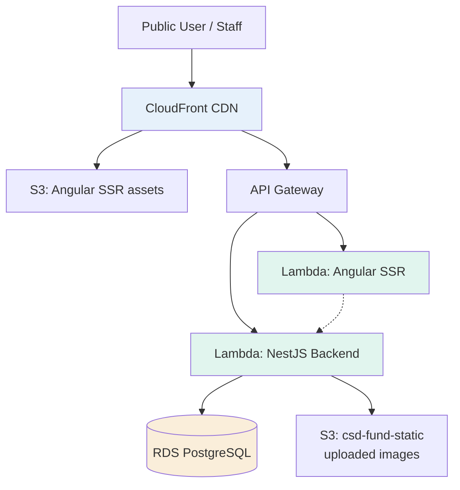
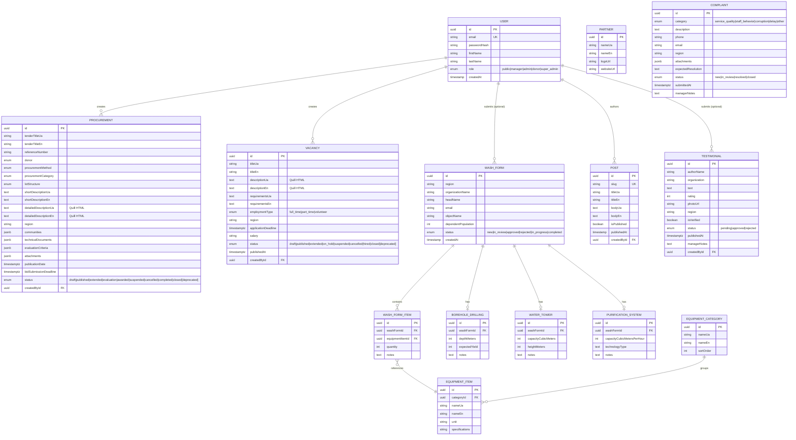
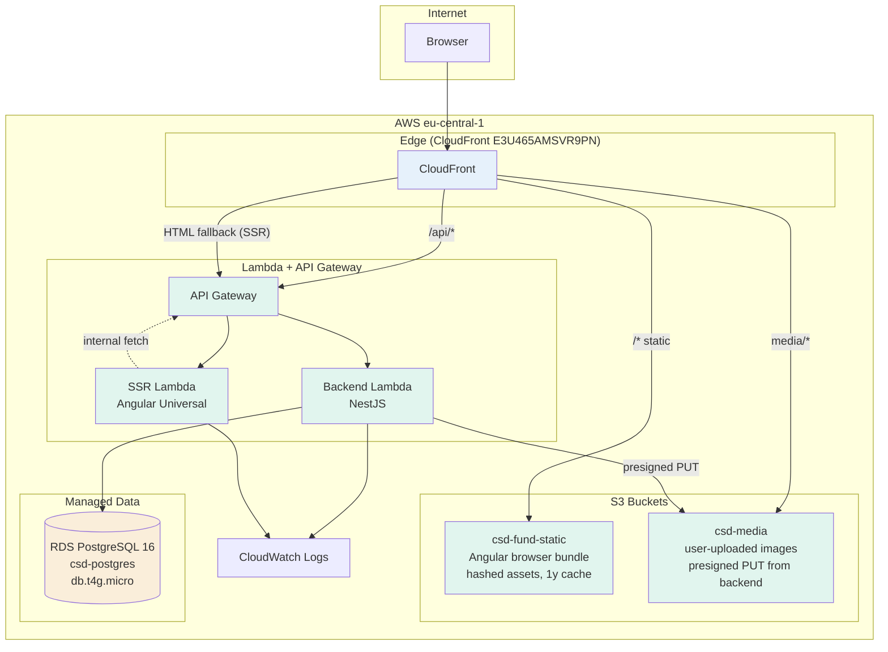

# CSD Fund Web Portal — Architecture & Operations Guide

> **Location:** `docs/ARCHITECTURE.md`
> **Audience:** Primarily developers joining the project. Also useful for CSD fund management, donor compliance reviewers (GIZ, UNICEF), and future open-source contributors.
> **Last updated:** May 2026 (sync pass against actual code; see CLAUDE.md for ongoing drift policy)

---

## Table of Contents

1. [Introduction](#1-introduction)
2. [Glossary](#2-glossary)
3. [Platform Overview](#3-platform-overview)
4. [Technology Stack](#4-technology-stack)
5. [Repository Structure](#5-repository-structure)
6. [Data Model (ER Diagram)](#6-data-model-er-diagram)
7. [Feature Catalogue](#7-feature-catalogue)
    - 7.1 [Public Website](#71-public-website)
    - 7.2 [Authentication & Authorization](#72-authentication--authorization)
    - 7.3 [WASH Needs Assessment](#73-wash-needs-assessment)
    - 7.4 [Cooperation Modules](#74-cooperation-modules)
    - 7.5 [Admin Panel](#75-admin-panel)
    - 7.6 [Content & Blog](#76-content--blog)
8. [Deployment Topology (AWS)](#8-deployment-topology-aws)
9. [Environment Variables Reference](#9-environment-variables-reference)
10. [Local Development Setup](#10-local-development-setup)
11. [Common Commands](#11-common-commands)
12. [CI/CD & Release Process](#12-cicd--release-process)
13. [Database Migrations](#13-database-migrations)
14. [Security & Vulnerabilities](#14-security--vulnerabilities)
    - 14.1 [Resolved Issues](#141-resolved-issues)
    - 14.2 [Known Unresolved Issues](#142-known-unresolved-issues)
    - 14.3 [Accepted Trade-offs](#143-accepted-trade-offs)
15. [Known Incidents Timeline](#15-known-incidents-timeline)
16. [Runbook — Operational Procedures](#16-runbook--operational-procedures)
17. [Technical Debt](#17-technical-debt)
18. [Contribution Guidelines](#18-contribution-guidelines)
19. [FAQ for New Developers](#19-faq-for-new-developers)

---

## 1. Introduction

The CSD Fund Web Portal (`www.csd-fund.org`) is the public-facing platform and operational system for the Charitable Fund "Centre for Support and Development" — a Ukrainian NGO focused on WASH (Water, Sanitation, Hygiene) recovery, infrastructure reconstruction, and shelter support in regions affected by the war.

The portal serves three distinct user groups:

- **Public visitors** — learn about the fund, read blog posts, view partners, submit WASH needs assessments, apply to vacancies, leave testimonials, file complaints.
- **Communities & partners** — submit structured WASH needs forms with detailed infrastructure requirements (borehole drilling, water towers, purification systems, equipment from a 21-category catalogue).
- **Staff (managers, admins)** — moderate submissions, manage procurements/vacancies, review complaints confidentially, manage user roles.

The project is built, maintained, and deployed by a small team on a tight budget (~$20–30/month AWS footprint).

---

## 2. Glossary

| Term | Meaning |
|------|---------|
| **BOQ** | Bill of Quantities — itemized list of materials/works in procurement |
| **CSD** | Charitable Fund "Centre for Support and Development" (the NGO running this portal) |
| **CSP** | Content Security Policy — HTTP header that restricts what resources a page can load |
| **GIZ** | Deutsche Gesellschaft für Internationale Zusammenarbeit — German development agency (donor) |
| **IOM** | International Organization for Migration — UN agency (potential donor) |
| **ITB** | Invitation to Bid — a formal tender method (synonymous with open tender) |
| **LDS** | Latter-day Saint Charities — a donor organization |
| **LTA** | Long-Term Agreement — UNICEF's framework agreements listing pre-qualified suppliers and equipment |
| **PII** | Personally Identifiable Information (phone, email, full name) |
| **RFP** | Request for Proposals — procurement method for complex services where the approach matters |
| **RFQ** | Request for Quotation — procurement method for simple goods where price is the main factor |
| **SSR** | Server-Side Rendering (Angular Universal) |
| **TOR** | Terms of Reference — scope-of-works document attached to a procurement |
| **UHF** | Ukraine Humanitarian Fund — pooled fund managed by OCHA (donor) |
| **UNICEF** | United Nations Children's Fund (donor) |
| **WASH** | Water, Sanitation, and Hygiene — humanitarian infrastructure sector |

---

## 3. Platform Overview

### High-level architecture



### Request flow

1. User visits `https://www.csd-fund.org/some/page`
2. CloudFront (`E3U465AMSVR9PN`) serves the matching asset: static files from S3, API calls proxied to API Gateway, HTML page rendered by the SSR Lambda.
3. SSR Lambda calls the backend Lambda (same API Gateway) to fetch data needed for initial render.
4. Backend Lambda connects to RDS PostgreSQL, processes the request, returns JSON.
5. Hydration happens in the browser; subsequent navigation is client-side.

### Key design decisions

- **Monorepo with two apps** (`backend/`, `ui/`) sharing one git workflow.
- **Serverless all the way** — no EC2, no ECS, no Kubernetes. Lambda cold starts are the trade-off.
- **PostgreSQL + TypeORM** — single database, no microservices, no message queues (intentional simplicity for a small team).
- **SSR for SEO** — blog posts, vacancies, and procurements must be indexable by Google.
- **Bilingual by default** — every entity has both UA and EN fields, language switcher routes through the whole app.

---

## 4. Technology Stack

### Backend (`backend/`)

| Layer | Technology | Version |
|-------|-----------|---------|
| Runtime | Node.js | 22.x (CI pins `22.17.0`) |
| Language | TypeScript | 5.7.x |
| Framework | NestJS | 11.x |
| Database | PostgreSQL (RDS) | 16.x |
| Local DB | PostgreSQL (Homebrew `postgresql@14` on 5432, or Docker `postgres:16` mapped to host 5433) | 14.x / 16.x |
| ORM | TypeORM | 0.3.28 |
| Auth | `@nestjs/jwt` + `passport` + `passport-jwt` + `passport-local` | 11.x / 0.7.x / 4.x / 1.x |
| Validation | `class-validator` + `class-transformer` | 0.15.x / 0.5.x |
| Sanitization | `sanitize-html` | 2.17.x |
| Lambda adapter | `@codegenie/serverless-express` | 4.17.x |
| Reports | `exceljs` (XLSX), manual CSV with UTF-8 BOM | 4.x |
| Deployment | Serverless Framework | v4 |
| Testing | Jest | 30.x |
| Linting | ESLint (flat config) + Prettier | ESLint 9 |

### Frontend (`ui/`)

| Layer | Technology | Version |
|-------|-----------|---------|
| Framework | Angular (standalone + signals) | 21.2.x |
| Language | TypeScript | 5.9.x |
| SSR | `@angular/ssr` (with `provideClientHydration(withEventReplay())`) | 21.2.x |
| HTTP entry (Lambda) | `serverless-http` wrapping the SSR Express app (`ui/lambda.mjs`) | 4.x |
| Rich text | `ngx-quill` + Quill 2 | 30.0.x / 2.0.x |
| i18n | `@ngx-translate/core` + `@ngx-translate/http-loader` (fallback `ua`) | 17.x |
| Maps | Leaflet + `leaflet.markercluster` (Activity map) | — |
| Icons | `lucide-angular` | 1.x |
| Builder | `@angular/build:application` (esbuild-based) | 21.2.x |
| Test runner | Vitest (via `ng test` → `@angular/build:unit-test`) | 4.x |
| Linting | `angular-eslint` + `typescript-eslint` + Prettier | ESLint 10 / angular-eslint 21.3.x |

### Infrastructure

| Service | Purpose |
|---------|---------|
| AWS Lambda | Backend runtime + SSR runtime |
| AWS API Gateway | HTTP entry point for both Lambdas |
| AWS RDS | PostgreSQL 16, db.t4g.micro |
| AWS S3 | Static assets + user-uploaded images |
| AWS CloudFront | CDN, TLS termination, SPA fallback |
| AWS IAM | Role-based access for Lambdas and deploy pipeline |
| GitHub Actions | CI/CD, runs on merge to `main` |

---

## 5. Repository Structure

```
csd-fund/
├── README.md                    # High-level intro + link to this doc
├── CLAUDE.md                    # Repo-wide rules for AI-assisted work
├── docs/
│   └── ARCHITECTURE.md          # This file
├── .github/
│   ├── CODEOWNERS               # @Kirnadz is default reviewer
│   └── workflows/
│       └── deploy.yml           # GitHub Actions workflow (the live one)
├── backend/
│   ├── lambda.ts                # ⚠ AWS Lambda handler (sits at backend ROOT, not in src/)
│   ├── serverless.yml           # Serverless Framework v4 config
│   ├── CLAUDE.md
│   ├── eslint.config.mjs
│   ├── nest-cli.json
│   ├── package.json
│   ├── tsconfig.json
│   ├── tsconfig.build.json
│   └── src/
│       ├── app.module.ts        # Root module (TypeOrmModule.forRootAsync + all feature modules)
│       ├── app.controller.ts    # GET / and GET /health (smoke-tested by CI)
│       ├── main.ts              # Local bootstrap; also calls runSeeds() on startup
│       ├── common/pipes/        # Shared pipes (SanitizeHtmlPipe)
│       ├── database/
│       │   ├── data-source.ts            # TypeORM CLI datasource (standalone for migrations)
│       │   ├── migrations/               # All TypeORM migration files
│       │   ├── run-seeds.ts              # Bootstrap chain — currently only equipment catalog
│       │   ├── run-seeds-standalone.ts   # Same equipment seed runnable outside Nest
│       │   ├── seed-equipment.ts
│       │   └── seed-super-admin.ts       # MANUAL one-shot script; not in bootstrap chain
│       └── modules/             # Feature modules (mount in parens where ≠ folder name)
│           ├── auth/            # /api/auth
│           ├── about/           # /api/about — bilingual sections + documents
│           ├── blog/            # /api/blog
│           ├── complaint/       # /api/complaints (plural)
│           ├── content/         # /api/pages
│           ├── cooperation/     # /api/cooperation — umbrella metadata
│           ├── equipment-catalog/   # /api/equipment-catalog
│           ├── needs/           # /api/needs-forms — WASH assessment
│           ├── partners/        # /api/partners
│           ├── procurement/     # /api/procurement
│           ├── testimonial/     # /api/testimonials (plural)
│           ├── upload/          # /api/upload — S3 presigned PUT URLs
│           ├── users/           # /api/users
│           └── vacancy/         # /api/vacancies (plural)
├── ui/
│   ├── lambda.mjs               # SSR Lambda entry — serverless-http wrapping app from server.ts
│   ├── ssr-lambda.mjs           # Legacy alt entry — not referenced by serverless.yml (orphaned)
│   ├── serverless.yml
│   ├── angular.json
│   ├── CLAUDE.md
│   ├── eslint.config.mjs
│   ├── package.json
│   └── src/
│       ├── main.ts              # Browser entry
│       ├── main.server.ts       # SSR bootstrap
│       ├── server.ts            # Express app for SSR; exports { app, reqHandler }
│       ├── styles.scss
│       ├── environments/{environment,environment.prod}.ts
│       ├── app/
│       │   ├── app.ts
│       │   ├── app.config.ts            # Browser providers (router, http+interceptor, hydration, i18n)
│       │   ├── app.config.server.ts     # SSR providers (mergeApplicationConfig + withRoutes)
│       │   ├── app.routes.ts            # Public routes
│       │   ├── app.routes.server.ts     # Per-route render mode (blog/:slug=Server, activity-map=Client)
│       │   ├── core/
│       │   │   ├── guards/      # managerGuard, adminGuard, superAdminGuard, authGuard
│       │   │   ├── interceptors/  # auth.interceptor (JWT injection, SSR-safe)
│       │   │   └── services/    # api.service (prepends /api), auth.service (signal-based)
│       │   ├── features/        # Lazy-loaded feature components
│       │   │   ├── home/
│       │   │   ├── about/
│       │   │   ├── blog/
│       │   │   ├── activity-map/        # Leaflet + marker clustering, signal-driven filters
│       │   │   ├── cooperation/{procurement,vacancy,testimonial,complaint}/
│       │   │   ├── needs/wash-form/
│       │   │   ├── admin/               # managerGuard at root; sub-routes use adminGuard / superAdminGuard
│       │   │   ├── partners/            # ⚠ FROZEN — route commented out in app.routes.ts
│       │   │   ├── login/ register/ forgot-password/ reset-password/
│       │   │   └── contact/
│       │   ├── layout/          # header, footer
│       │   └── shared/          # carousel, location-selector, sticky-cta, quill-html pipe, etc.
│       └── assets/
│           ├── data/locations.json  # 29,708 Ukrainian settlements (frontend asset, not DB-seeded)
│           ├── data/activities.json # Activity-map data
│           ├── i18n/{en,ua}.json
│           └── images/
└── convertors/
    └── convert-locations.py     # Python utility to rebuild locations.json from source data
```

---

## 6. Data Model (ER Diagram)



> The actual database has 20+ tables. The diagram above shows core business entities; less critical tables (session-like entities, transient state) are omitted for readability.

---

## 7. Feature Catalogue

### 7.1 Public Website

- Landing page (`/`) with hero, mission statement, featured blog posts, impact stats (signal-driven service).
- About page (`/about`) — CMS-driven sections + downloadable documents.
- Blog (`/blog`, `/blog/:slug`) with Quill-formatted posts in UA/EN; post detail uses a route resolver.
- Activity map (`/activity-map`) — Leaflet map with marker clustering, category sidebar, signal-based filtering; data sourced from `ui/src/assets/data/activities.json`.
- Partners (`/partners`) — ⚠ **FROZEN**: route and header link are commented out until the fund provides partner logos & data. `PartnersComponent` and backend `GET /api/partners` are ready; to re-enable, uncomment the block in `ui/src/app/app.routes.ts` (search "FROZEN") and the matching nav link in `ui/src/app/layout/header/header.ts`.
- Contact page (`/contact`).
- Public Cooperation pages:
    - Procurement tenders (`/cooperation/procurement`)
    - Vacancies (`/cooperation/vacancy`)
    - Testimonials (`/cooperation/testimonial`)
    - Complaints submission (`/cooperation/complaint`)
- Needs assessment (`/needs/wash-form`).

All pages are SSR-rendered for SEO. Language switcher (UA/EN) rotates through the whole UI instantly.

### 7.2 Authentication & Authorization

**Auth flow:**
1. Register (`POST /api/auth/register`) — any public user.
2. Login (`POST /api/auth/login`) returns a JWT (HS256, signed with `JWT_SECRET`).
3. JWT stored in `localStorage`; sent as `Authorization: Bearer <token>` via `auth.interceptor.ts`.
4. Forgot password flow via email token (`POST /api/auth/forgot-password`, `POST /api/auth/reset-password`).

**Roles** (hierarchy in practice, not enforced as inheritance):
- `public` — default, no privileges.
- `donor` — reserved for future donor-only views.
- `manager` — can create/edit procurements, vacancies, testimonials (moderate), see WASH forms.
- `admin` — all of the above + complaints.
- `super_admin` — all of the above + user role management.

**Guards** (in `ui/src/app/core/guards/auth.guard.ts`):
- `authGuard` — any authenticated user.
- `managerGuard` — manager, admin, super_admin.
- `adminGuard` — admin, super_admin.
- `superAdminGuard` — super_admin only.

On the backend, `JwtAuthGuard + RolesGuard + @Roles(...)` decorator enforces access on controllers.

### 7.3 WASH Needs Assessment

A structured 8-step form (`/needs/wash-form`, steps indexed 0–7 in `wash-form.ts`) for communities to submit infrastructure needs. Fields include:

- Organization & contact details.
- Object being restored.
- Dependent population count.
- Location (cascading Region → District → Community → Settlement selector powered by 29,708-row `locations.json`).
- Optional sub-sections: borehole drilling, water tower, purification system.
- Equipment items from a 21-category catalogue (seeded from UNICEF LTA data).
- Status tracking through admin review.

Admin UI lists, filters by status/region, exports to CSV, and allows detail view.

### 7.4 Cooperation Modules

Four sibling modules, all accessible under `/cooperation/*` publicly and `/admin/*` for staff:

| Module | Public list | Status lifecycle | Special features |
|--------|-------------|------------------|------------------|
| Procurement | `/cooperation/procurement` | draft → published → extended → evaluation → awarded → completed (or suspended/cancelled) | 7-step creation form, Quill rich text, evaluation criteria, attachments |
| Vacancy | `/cooperation/vacancy` | draft → published → extended → on_hold → hired (or suspended/cancelled). Legacy `closed` still exists in the PG enum but is `@deprecated` — use `hired`. | Employment types, application deadline tracking |
| Testimonial | `/cooperation/testimonial` | pending → approved (or rejected) | Rating 1-5, verification toggle, moderation flow |
| Complaint | — (private) | new → in_review → resolved → closed | Confidential, anonymous submission, PII toggle in admin, CSV export with UTF-8 BOM |

### 7.5 Admin Panel

Single-page admin shell at `/admin` with:

- Left sidebar with role-based menu items (manager sees subset, admin more, super_admin everything).
- Off-canvas hamburger menu on mobile.
- Tabs/sections: WASH Forms, Procurements, Vacancies, Testimonials, Complaints (admin+), Users (super_admin only).
- Per-module features: paginated tables, search, filters, inline status change with confirmation, edit links to forms, delete (with hard-delete restrictions — see Section 14.3).

### 7.6 Content & Blog

- Blog posts are Quill HTML, sanitized on save via `SanitizeHtmlPipe`.
- Static pages (About, etc.) use the Content module with similar HTML sanitization.
- All HTML outputs in the UI are rendered through `QuillHtmlPipe` which handles `&nbsp;`, Quill list markers, and safe HTML rendering.

---

## 8. Deployment Topology (AWS)



### Key resources

| Resource | Identifier | Notes |
|----------|-----------|-------|
| Region | `eu-central-1` | Frankfurt — GDPR-friendly, close to Ukrainian users |
| CloudFront distribution | `E3U465AMSVR9PN` | Handles TLS, caching, SPA fallback |
| Domain | `www.csd-fund.org` | CNAME → CloudFront |
| Backend Lambda | `csd-api-prod-api` | CloudFormation stack `csd-api-prod`; 512 MB / 29 s timeout |
| SSR Lambda | `csd-ssr-prod-ssr` | CloudFormation stack `csd-ssr-prod`; 512 MB / 29 s timeout |
| API Gateway base (prod) | `https://vzdw0zf80h.execute-api.eu-central-1.amazonaws.com/prod` | Direct URL behind CloudFront; embedded in `ui/src/environments/environment.prod.ts` |
| S3 bucket (browser bundle) | `csd-fund-static` | Public read via CloudFront; hashed assets 1y immutable, HTML no-cache |
| S3 bucket (user media) | `csd-media` | Signed PUT from backend; backend Lambda has `s3:PutObject` on `csd-media/*` only |
| RDS endpoint | `csd-postgres.cfgy4a0e2bo6.eu-central-1.rds.amazonaws.com` | PostgreSQL 16, `db.t4g.micro`, SSL required (`rejectUnauthorized: false`) |
| CloudWatch log groups | `/aws/lambda/csd-api-prod-api` · `/aws/lambda/csd-ssr-prod-ssr` | 30-day retention by default |

### Cost profile (monthly)

- RDS db.t4g.micro: ~$13
- Lambda invocations + duration: ~$1–3 (within free tier most months)
- S3 storage + requests: ~$0.50–2
- CloudFront egress: ~$1–5 (free tier covers first 1 TB)
- **Total: ~$20–30/month** at current traffic levels.

---

## 9. Environment Variables Reference

### Backend (`backend/.env` — runtime; see `.env.example` for the canonical list)

```
# Database (consumed by AppModule TypeOrmModule.forRootAsync and CLI data-source)
DB_HOST=localhost
DB_PORT=5432            # Homebrew postgres@14 default; Docker users override to 5433
DB_USERNAME=csd_user
DB_PASSWORD=csd_password
DB_NAME=csd_db

# JWT (signing only — expiry is hardcoded in code as '7d' in auth.module.ts)
JWT_SECRET=********     # 256-bit random; openssl rand -hex 32

# CORS / email links
FRONTEND_URL=http://localhost:4200

# Optional flag — when 'production', enables SSL to RDS (rejectUnauthorized: false)
NODE_ENV=development
```

**Production-only (set by Serverless from GitHub Secrets, see `backend/serverless.yml`):**

```
NODE_ENV=production
AWS_S3_MEDIA_BUCKET=csd-media     # hardcoded in serverless.yml, not in .env
```

**Bootstrap-only (used by `npm run seed:super-admin` — do NOT commit, do NOT keep in `.env*`):**

```
SUPER_ADMIN_EMAIL=...
SUPER_ADMIN_PASSWORD=...          # ≥16 chars, upper+lower+digit+symbol
```

**What is NOT in env:**

- No `EMAIL_*` vars — there is no SMTP integration yet. Password-reset tokens are generated and stored in the DB; email delivery is not wired (the controller returns `200` regardless to avoid email-enumeration). Plan to add when SES/SMTP provider is selected.
- No `DATABASE_SSL` flag — SSL is controlled implicitly by `NODE_ENV === 'production'`.
- No `JWT_EXPIRES_IN` — value is hardcoded `'7d'` in `auth.module.ts`.
- No `AWS_ACCESS_KEY_ID` / `AWS_SECRET_ACCESS_KEY` at runtime — Lambda uses its IAM role (S3:PutObject on `csd-media/*` granted in `serverless.yml`).

### Frontend (`ui/src/environments/`)

```ts
// environment.ts — dev
export const environment = {
  production: false,
  apiUrl: 'http://localhost:3000',
};

// environment.prod.ts — swapped via angular.json fileReplacements
export const environment = {
  production: true,
  apiUrl: 'https://vzdw0zf80h.execute-api.eu-central-1.amazonaws.com/prod',
};
```

> **Never commit real values.** Production values for backend are injected via GitHub Actions secrets and Serverless Framework's `${env:VAR}` interpolation. The frontend's prod `apiUrl` is checked in only because it's the direct API Gateway URL (not a secret — anyone hitting <https://www.csd-fund.org> sees the same).

---

## 10. Local Development Setup

### Prerequisites

- **Node.js 22.x** (matches Lambda runtime) — use `nvm install 22` if needed
- **npm 10.x** (ships with Node 22)
- **PostgreSQL** — pick one:
    - **Homebrew** `postgresql@14` on host port **5432** (the README walkthrough and `.env.example` default): `brew install postgresql@14 && brew services start postgresql@14`
    - **Docker** `postgres:16` mapped to host port **5433** to avoid collision with a system postgres: `docker run -d --name csd-pg -e POSTGRES_PASSWORD=postgres -p 5433:5432 postgres:16`
- **macOS / Linux** (Windows via WSL2 not tested but likely works)

> Historically `docker-compose.yml` was removed after a port-collision incident (see Section 15, Incident #1). Today both Homebrew and Docker (via `docker run`, not compose) are in use by different developers. The lesson from that incident still applies: never run both at the same time on the same port.

### First-time setup

```bash
# 1. Clone the repo
git clone git@github.com:Kirnadz/csd-fund.git   # adjust to your remote
cd csd-fund

# 2. Create the local database (matches .env.example defaults)
createdb csd_db
psql csd_db -c "CREATE USER csd_user WITH PASSWORD 'csd_password';"
psql csd_db -c "GRANT ALL PRIVILEGES ON DATABASE csd_db TO csd_user;"

# 3. Backend setup
cd backend
cp .env.example .env   # then fill in local values (or keep defaults if they match)
npm install
npm run migration:run  # apply all migrations
npm run start:dev      # server on http://localhost:3000

# 4. Seed data (in a second terminal)
cd backend
npx ts-node src/database/run-seeds-standalone.ts

# 5. Frontend setup (in a third terminal)
cd ui
npm install
npm start              # Angular dev server on http://localhost:4200
```

You should be able to log in at `http://localhost:4200/login` with the seeded super_admin credentials.

### Creating / rotating the super_admin

The script is fail-fast — it requires `SUPER_ADMIN_EMAIL` and `SUPER_ADMIN_PASSWORD` env vars (no defaults, no editing the script). Password must be ≥16 chars with upper + lower + digit + symbol.

```bash
cd backend

# Create new super_admin (or promote existing user to super_admin role)
 SUPER_ADMIN_EMAIL='you@example.com' \
 SUPER_ADMIN_PASSWORD='<from password manager>' \
 npm run seed:super-admin

# Rotate password of an existing super_admin
 SUPER_ADMIN_EMAIL='you@example.com' \
 SUPER_ADMIN_PASSWORD='<new strong password>' \
 npm run seed:super-admin -- --rotate-password
```

(Leading space prevents the command landing in shell history when `HISTCONTROL=ignorespace` is set.)

Full provisioning + rotation runbook (including prod against RDS): see [`backend/README.md` → "Provisioning the super-admin"](../backend/README.md#provisioning-the-super-admin).

---

## 11. Common Commands

### Backend (`cd backend`)

| Command | Purpose |
|---------|---------|
| `npm run start:dev` | Nest dev server with hot reload |
| `npm run start:prod` | Run compiled dist (matches Lambda) |
| `npm run build` | Compile TypeScript to `dist/` |
| `npm run lint` | ESLint with `--fix` |
| `npm run format` | Prettier on `src/` and `test/` |
| `npm run test` | Jest unit tests |
| `npm run test:e2e` | E2E tests against a running server |
| `npm run migration:generate -- src/database/migrations/NameOfMigration` | Generate migration from entity diff |
| `npm run migration:run` | Apply pending migrations |
| `npm run migration:revert` | Revert the last migration |
| `npm run migration:show` | List migrations and their state |
| `npm run seed:super-admin` | Manual one-shot to create or rotate the super-admin (see Section 10) |

### Frontend (`cd ui`)

| Command | Purpose |
|---------|---------|
| `npm start` | Angular dev server (hot reload, no SSR) |
| `npm run build` | Production build (both browser + SSR bundles) |
| `npm run watch` | Development build in watch mode |
| `npm run serve:ssr:ui` | Run the compiled SSR server locally |
| `npm run lint` | Run `ng lint` |
| `npm run lint:fix` | `ng lint --fix` |
| `npm run format` | Prettier on TS/HTML/SCSS |
| `npm run test` | Vitest 4 unit tests (via `@angular/build:unit-test` builder) |

### Deployment

```bash
# Backend
cd backend
npx serverless deploy --stage prod

# Frontend (browser + SSR)
cd ui
npm run build
npx serverless deploy --stage prod
```

In practice, both are triggered by GitHub Actions on merge to `main`.

---

## 12. CI/CD & Release Process

- **Workflow:** GitFlow. Feature branches → PR → review → merge to `main`.
- **GitHub Actions trigger** (`.github/workflows/deploy.yml`):
    - On PR **merge** to `main` (`pull_request: types: [closed]` filtered by `merged == true`), or
    - Manual `workflow_dispatch` (cancels queued PR-merge runs via concurrency group `deploy-prod-${{ github.event_name }}`).
    - **NOT** on direct push — direct pushes to `main` are blocked by branch protection; even if one slipped through, the workflow wouldn't fire.
- **Pipeline order:**
    1. Backend job: checkout → `npm ci` (backend) → `migration:show` → conditional `migration:run` if pending → `nest build` → `serverless deploy --stage prod` → smoke test `GET /api/health` (5 retries with backoff) → success/failure summary with CloudWatch links.
    2. Frontend job (`needs: deploy-backend` — only runs if backend succeeded): checkout → `npm ci` (ui) → `ng build --configuration production` → `aws s3 sync` for hashed assets (1y immutable cache) + HTML (no-cache) → `serverless deploy --stage prod` for SSR Lambda → `aws cloudfront create-invalidation --paths "/*"` → smoke test `GET /` checking `<app-root>` presence (6 retries) → success/failure summary.
- **Secrets** sourced from GitHub Secrets, injected as job env vars: `AWS_ACCESS_KEY_ID`, `AWS_SECRET_ACCESS_KEY`, `SERVERLESS_ACCESS_KEY`, `DB_*`, `JWT_SECRET`, `FRONTEND_URL`, `BACKEND_URL`.
- **Rollback:** re-run the deploy workflow at a previous commit SHA via `workflow_dispatch`, or use Serverless Framework's `rollback` feature (`npx serverless rollback --timestamp <ts>` from `backend/` or `ui/`).
- **Zero downtime** achieved through Lambda versioning — new version deploys and the API Gateway / CloudFront mapping switches atomically.

---

## 13. Database Migrations

### Key principles

1. **Never use `synchronize: true` in production.** All schema changes go through TypeORM migrations. Historically the project used `synchronize: true`; this was removed and replaced with migrations around Task 3.1.
2. **`migrationsTransactionMode: 'each'`** is set in `data-source.ts`. This means each migration runs in its own transaction by default, and individual migrations can opt out via `transaction = false`.
3. **Some migrations CANNOT run in a transaction** — notably PostgreSQL `ALTER TYPE ... ADD VALUE` cannot be followed by `UPDATE` using the new value in the same transaction. See Section 15, Incident #3.
4. **Enum values can be added but NOT removed.** If you need to "remove" an enum value, you must:
    - Remap all rows using that value to a valid replacement.
    - Mark the value as `@deprecated` in the TypeScript enum and keep it as a legacy value.
    - Optionally, recreate the enum in a complex migration (rename old → temp → new, migrate data, drop old). **Usually not worth it.**

### Directory

All migrations live in `backend/src/database/migrations/`. Filename format: `<timestamp>-<Name>.ts` (timestamp in ms).

### Generating new migrations

```bash
cd backend
# 1. Make your changes to an @Entity class.
# 2. Ensure local DB schema is up-to-date:
npm run migration:run
# 3. Generate a migration from the entity diff:
npm run migration:generate -- src/database/migrations/AddSomeColumn
# 4. Review the generated SQL CAREFULLY before committing.
# 5. Apply locally to test:
npm run migration:run
```

### Running on prod

Handled automatically by GitHub Actions before deploy. Manual override:

```bash
cd backend
# With production .env (via AWS SSM or similar):
DATABASE_HOST=******** DATABASE_PASSWORD=******** npm run migration:run
```

---

## 14. Security & Vulnerabilities

This section documents the portal's security posture — what's been fixed, what's still open, and what trade-offs were accepted.

### 14.1 Resolved Issues

#### XSS in user-submitted Quill HTML

**Issue:** Quill editor outputs HTML. If rendered without sanitization, `<script>` tags or `javascript:` URIs in an attacker-crafted testimonial or blog post would execute in other users' browsers.

**Resolution:**
- `SanitizeHtmlPipe` (`backend/src/common/pipes/sanitize-html.pipe.ts`) runs on every `@Post`/`@Patch` for modules accepting Quill HTML (procurement, vacancy, blog, content).
- Uses `sanitize-html` npm package with an allow-list of tags and attributes.
- Also auto-attaches `rel="noopener noreferrer" target="_blank"` to all `<a>` tags via `transformTags`.
- Frontend additionally applies Angular's built-in sanitizer via `[innerHTML]` and custom `QuillHtmlPipe`.
- **Defense in depth** — both ends sanitize.

**Verified by:** manual XSS test cases blocking `<script>`, `<iframe>`, `javascript:` URIs, `onerror` attributes, while preserving legitimate formatting.

#### Pure-ESM dependency breaking CommonJS Lambda

**Issue:** `isomorphic-dompurify` transitively pulled in `@exodus/bytes`, a pure-ESM package. AWS Lambda's Node 22 CommonJS loader threw `ERR_REQUIRE_ESM` before Nest even bootstrapped, causing a total prod outage.

**Resolution:**
- Replaced `isomorphic-dompurify` with `sanitize-html` (pure-CJS, no DOM polyfill).
- **Lesson:** For Lambda backends, audit transitive ESM deps in any sanitization or parsing library before introducing them.

See Incident #2 for full timeline.

#### Enum value add + use in same transaction

**Issue:** PostgreSQL disallows using a freshly-added enum value in the same transaction that added it. A naive migration that did `ALTER TYPE ... ADD VALUE 'extended'` followed by `UPDATE procurements SET status = 'extended'` would fail with "unsafe use of new value of enum type."

**Resolution:**
- Split into two migrations: one adds enum values with `public transaction = false`; the second remaps data normally.
- `migrationsTransactionMode: 'each'` added to `data-source.ts` to enable per-migration transaction control.

See Incident #3.

#### Two PostgreSQL servers on port 5432 (local dev)

**Issue:** Developer machines had both Homebrew `postgresql@14` and a `docker-compose` PostgreSQL 16 container, both claiming port 5432. Migrations would apply to one; the app connected to the other. Confusing, hard to debug.

**Resolution:** Removed `docker-compose.yml`. Today both setups coexist by convention: Homebrew binds 5432, Docker (via `docker run -p 5433:5432 postgres:16`) binds 5433. `.env.example` defaults to 5432; Docker users override `DB_PORT=5433` in their local `.env`. **Never run both bound to the same port on the same machine.**

#### Cost Explorer access

**Issue:** AWS billing access was blocked for non-root users, preventing the team from monitoring costs.

**Resolution:** Inline IAM policy granted `ce:GetCostAndUsage`, `ce:GetCostForecast`, etc. to the deploy user. Budget alerts configured at $30/month threshold.

### 14.2 Known Unresolved Issues

#### `any` types throughout the codebase

**Status:** 130+ ESLint warnings for `@typescript-eslint/no-explicit-any`. Most are in older components (home.ts, blog components, image upload flows).

**Impact:** Low — TypeScript's type safety is weakened in those areas, but no runtime issues reported.

**Plan:** Incremental typing as touched during feature work. Tracked in Technical Debt (Section 17).

#### Label-input a11y associations

**Status:** 109 ESLint warnings for `@angular-eslint/template/label-has-associated-control`. Forms use wrapper-style labels (`<label>text <input></label>`) which screen readers handle implicitly, but explicit `for="id"` associations would be more robust.

**Impact:** Medium — current implementation works for most screen readers, but WCAG 2.1 Level AA technically requires explicit association.

**Plan:** Sweep through all forms in a dedicated PR. Tracked in Technical Debt.

#### SSR fetches fail silently when backend is down

**Status:** During `npm start` in `ui/`, if the backend isn't running, SSR throws `ECONNREFUSED` for every API call during server-side render.

**Impact:** Low in dev (just noise); in production the backend and SSR are co-deployed, so this is unlikely to occur. But there is no graceful "data loading" UI if the backend genuinely goes down in prod.

**Plan:** Wrap `api.service.ts` SSR calls in try/catch with fallback empty-state rendering. Tracked in Technical Debt.

#### No rate limiting on public endpoints

**Status:** `POST /api/complaints`, `POST /api/testimonials`, `POST /api/needs-forms/wash` accept submissions without any rate limit. An attacker could flood the database with spam.

**Impact:** Medium — no automated abuse observed yet, but the risk is real.

**Plan:** Add `@nestjs/throttler` with per-IP limits (e.g., 5 submissions per hour). API Gateway throttling as a second layer.

#### CloudFront cache invalidation is not path-specific

**Status:** Current deploy invalidates `/*` on every release, costing ~$0.005 per invalidation but slowing down cache warm-up.

**Impact:** Low (cost) / medium (user-perceived latency after deploys).

**Plan:** Invalidate only changed paths based on diff.

#### `createdBy` sometimes NULL after user deletion

**Status:** User entity has `onDelete: 'SET NULL'` for reverse relations. Deleting a user leaves orphaned procurements/vacancies with `createdById = NULL`, which is fine technically but loses audit trail.

**Impact:** Low — users are rarely deleted.

**Plan:** Consider soft-delete on users (deactivate instead of delete).

### 14.3 Accepted Trade-offs

These are conscious decisions, not bugs:

- **No soft-delete anywhere.** We use `@deprecated` enum values and `cancelled` status instead. Hard deletes are strictly gated (only `draft` procurement/vacancy, only `rejected` testimonial, only `closed` complaint). Simpler, less edge-case risk.
- **Legacy `/publish`, `/approve`, `/reject` endpoints kept** for backward compat until UI fully uses `/status`. To be removed after stabilization.
- **Quill HTML stored as raw string, not JSON delta.** Simpler rendering, but editing requires the exact same Quill version. Acceptable for current needs.
- **No audit log.** Status changes don't record who changed what when. `createdBy` captures creation; updates are not logged. May add this if donor compliance requires it.
- **JWT in localStorage, not httpOnly cookies.** Accepted XSS risk in exchange for simpler cross-origin dev setup and serverless-friendliness. If XSS controls prove inadequate, migrate to cookies.
- **No CSP header on frontend.** Currently relies on sanitization alone. CSP would be an additional defense layer.

---

## 15. Known Incidents Timeline

### Incident #1: Two PostgreSQL servers on one port (local dev)

**Date:** Task 2, mid-development.
**Severity:** Dev-environment only.

**Symptoms:** `npm run migration:run` would complete, but the app would still see "missing columns." Opening `docker-compose exec psql` showed an empty schema; opening `psql` directly showed the schema.

**Root cause:** Homebrew `postgresql@14` service was running from install time; someone later added `docker-compose.yml` with `postgres:16`. Both claimed port 5432. Connections were racing.

**Resolution:** Deleted `docker-compose.yml`. Today Docker is back in use by some developers, but via direct `docker run -p 5433:5432 postgres:16` — different host port, no collision. `.env.example` defaults to Homebrew's 5432; Docker users override `DB_PORT=5433`.

**Lesson:** If you add a new DB setup approach, bind it to a distinct host port and document the convention in `.env.example`.

### Incident #2: ESM dependency caused prod outage

**Date:** Task 2 merge to main.
**Severity:** Critical — all endpoints returned 500.

**Timeline:**
- 00:00 — Task 2 PR merged to `main`. GitHub Actions auto-deployed.
- 00:03 — Homepage starts returning 500. Vacancies, procurements, blog — all 500.
- 00:05 — Initial panic: "is the database wiped?" Safety RDS snapshot `csd-postgres-safety-20260423-0003` created.
- 00:12 — Database confirmed intact. Issue is at API layer.
- 00:18 — CloudWatch logs show `Error [ERR_REQUIRE_ESM]: require() of ES Module ... @exodus/bytes/index.js` during cold start. Lambda cannot load Nest.
- 00:22 — Traced dependency chain: `isomorphic-dompurify` → `jsdom` → `html-encoding-sniffer` → `@exodus/bytes` (pure ESM).
- 00:25 — Decision: replace `isomorphic-dompurify` with `sanitize-html`.
- 00:30 — Hotfix PR merged, deployed. Outage resolved.

**Root cause:** Node 22 Lambda runtime with CommonJS `require()` cannot load pure-ESM packages, even transitively.

**Resolution:**
- `sanitize-html` replaces `isomorphic-dompurify`.
- Added to PR review checklist: "If adding any HTML/XML/crypto library, verify transitive deps aren't pure-ESM via `npm ls <package>` and inspection of `package.json` `"type": "module"` flags."

**Total downtime:** ~30 minutes.

**Lesson:** Smoke-test backend cold start against the actual Lambda runtime before merging, ideally via `sam local invoke` or `serverless invoke local`.

### Incident #3: TypeORM enum migration "unsafe use of new value"

**Date:** Task 3.1.
**Severity:** Blocked migration deployment.

**Symptoms:** Attempting to apply a migration that added `'extended'` to `ProcurementStatus` enum and then ran `UPDATE procurements SET status = 'extended' WHERE status = 'closed'` in the same migration failed with:

```
error: unsafe use of new value "extended" of enum type procurement_status_enum
```

**Root cause:** PostgreSQL's enum `ALTER TYPE ... ADD VALUE` creates the value in a way that it's not committed to the catalog until the transaction ends. TypeORM wraps each migration in a transaction by default.

**Resolution:**
- Split into two migrations:
    - `ExpandStatusEnums1777200000000` — adds enum values. Sets `public transaction = false` so TypeORM doesn't wrap it.
    - `RemapLegacyClosedStatuses1777200000001` — remaps data, runs normally.
- Added `migrationsTransactionMode: 'each'` to `data-source.ts` (otherwise TypeORM blocks `transaction = false` override with `ForbiddenTransactionModeOverrideError`).

**Lesson:** When adding enum values that existing code paths immediately use, plan for a two-step migration.

---

## 16. Runbook — Operational Procedures

### Deploy a hotfix to production

```bash
# From main branch with the fix committed
git checkout main
git pull
# Either:
#  - Wait for GitHub Actions (preferred), or
#  - Deploy manually:
cd backend && npx serverless deploy --stage prod
cd ../ui && npm run build && npx serverless deploy --stage prod
```

### Roll back the last deployment

```bash
cd backend
npx serverless rollback --stage prod  # lists versions
npx serverless rollback --stage prod --timestamp <chosen-timestamp>

cd ../ui
npx serverless rollback --stage prod --timestamp <chosen-timestamp>
```

Then invalidate CloudFront:

```bash
aws cloudfront create-invalidation --distribution-id E3U465AMSVR9PN --paths "/*"
```

### Create a safety RDS snapshot before risky work

```bash
aws rds create-db-snapshot \
  --db-instance-identifier csd-postgres \
  --db-snapshot-identifier "csd-postgres-safety-$(date +%Y%m%d-%H%M)"
```

Retention: delete snapshots manually after 1-2 weeks of stable operation.

### Promote a user to super_admin

```bash
# Via SQL on the production RDS (use caution):
psql $DATABASE_URL -c "UPDATE users SET role = 'super_admin' WHERE email = 'target@example.com';"
```

Preferred: log in as an existing super_admin and use `/admin/users` UI.

### Run a migration manually on production

```bash
cd backend
DATABASE_HOST=******** \
DATABASE_USER=******** \
DATABASE_PASSWORD=******** \
DATABASE_NAME=csd \
DATABASE_SSL=true \
npm run migration:run
```

Usually GitHub Actions does this. Manual override is for emergencies only.

### Check Lambda logs

```bash
# Backend
npx serverless logs --function api --stage prod --tail

# SSR
npx serverless logs --function ssr --stage prod --tail
```

Or via CloudWatch Logs console: log group `/aws/lambda/csd-api-prod-api` and `/aws/lambda/csd-ssr-prod-ssr`.

### Export complaints for donor reporting

As admin+ in the UI: `/admin/complaints` → set filters → click "Export CSV". The file includes UTF-8 BOM for Excel compatibility.

### Invalidate CloudFront cache after a content-only update

```bash
# Example — invalidate only blog HTML and the home page after a content update.
# Adjust paths to match what actually changed. Note: `/partners` is currently
# FROZEN (route commented out) — don't include it until the page is re-enabled.
aws cloudfront create-invalidation \
  --distribution-id E3U465AMSVR9PN \
  --paths "/" "/blog" "/blog/*"
```

---

## 17. Technical Debt

Ordered by approximate priority.

### High priority

- [ ] **Remove legacy `/publish`, `/approve`, `/reject` endpoints** after full UI migration to `/status` is verified in production.
- [ ] **Remove safety RDS snapshot** `csd-postgres-safety-20260423-0003` (created 2026-04-23; original 2-week window expired 2026-05-07 — **OVERDUE** as of 2026-05-17). Verify it still exists in AWS Console first (it may have been deleted already without updating this list); if present, delete and remove this item.
- [ ] **Add rate limiting** to public `POST` endpoints (`/api/complaints`, `/api/testimonials`, `/api/needs-forms/wash`).
- [ ] **Fix label-for-input a11y** across all forms (109 warnings).

### Medium priority

- [ ] **Type the 130+ `any` usages** across the frontend, especially `home.ts`, image upload flows, blog components.
- [ ] **Write E2E tests** for admin workflows (create procurement → publish → change status → delete).
- [ ] **Add audit log** for status changes on procurement, vacancy, testimonial, complaint.
- [ ] **Wrap SSR API calls** in try/catch with graceful fallback rendering.
- [ ] **Invalidate CloudFront selectively** based on deploy diff.
- [ ] **Dashboard landing on `/admin`** with counts (pending complaints, draft procurements, pending testimonials) — currently redirects to `/admin/wash-forms`.

### Low priority

- [ ] **CSV export for procurements/vacancies/testimonials** (only complaints has export now).
- [ ] **CSP header** on the frontend.
- [ ] **Migrate JWT to httpOnly cookies** if XSS controls prove inadequate.
- [ ] **Consider soft-delete on users** (currently hard delete breaks `createdBy` references).

### WASH form restructuring (scheduled)

The next major product initiative: a substantial rework of the WASH form — new structure, validation, tooltips/hints, re-organization of steps. Tracked separately from this document.

---

## 18. Contribution Guidelines

### Branch naming

- `feature/<short-name>` — new features
- `fix/<short-name>` — bug fixes
- `chore/<short-name>` — tooling, docs, refactor without behavior change
- `hotfix/<short-name>` — urgent production fixes directly from `main`

### Commit messages

Free-form but descriptive. Include the task context if relevant:

```
Task 3.1: Expand procurement status enum from 3 to 8 values

- Adds 5 new statuses: extended, evaluation, awarded, suspended, cancelled, completed
- Keeps legacy 'closed' as @deprecated
- Two-step migration: ExpandStatusEnums + RemapLegacyClosedStatuses
```

### Pull request checklist

- [ ] Code compiles (`npm run build` in both `backend/` and `ui/`).
- [ ] Lint passes (`npm run lint`).
- [ ] New entity fields have a migration (no `synchronize: true`).
- [ ] Any new HTML/XML/crypto library's transitive deps checked for pure-ESM (post-Incident #2 policy).
- [ ] Any new public endpoint has appropriate `@UseGuards` and `@Roles`.
- [ ] Any user-generated HTML input has `SanitizeHtmlPipe` applied.
- [ ] i18n keys added to both `ua.json` and `en.json` (no English-only text in UI).
- [ ] Non-trivial edits marked with `// CHANGED:` (or `// === ADDED: ===` for new blocks) — repo-wide review convention.
- [ ] Changes to this doc if architecture/security-relevant.

### Code style

- TypeScript strict mode for both apps.
- Standard ESLint config — follow Prettier auto-format.
- Angular: standalone components only, signals for state, `inject()` over constructor injection.
- Nest: feature modules with controller + service + entity + dto/. Avoid inline DTOs.
- No comments explaining "what" — only "why" when non-obvious.

---

## 19. FAQ for New Developers

**Q: Why is the local DB Homebrew and not Docker?**
A: See Incident #1. We had two Postgres servers racing on port 5432.

**Q: Why not `synchronize: true`?**
A: It was used early on, then removed after migrations were set up (Task 3.1). `synchronize` is dangerous in any environment that isn't a throwaway dev DB — it will silently drop columns.

**Q: Why `sanitize-html` instead of `DOMPurify`?**
A: See Incident #2. `isomorphic-dompurify` pulled in a pure-ESM transitive dep that crashed Lambda cold starts.

**Q: Why are enum values kept even when deprecated?**
A: PostgreSQL does not support `ALTER TYPE DROP VALUE`. Removing requires recreating the enum type, which is complex and risky. Marking `@deprecated` in TypeScript is pragmatic.

**Q: Where are the `admin` and `super_admin` roles defined?**
A: As a TypeScript enum `UserRole` in `backend/src/modules/users/entities/user.entity.ts`. Guards are in `ui/src/app/core/guards/auth.guard.ts`.

**Q: What makes `super_admin` different from `admin`?**
A: Only `super_admin` can change user roles (access to `/admin/users`). Otherwise they're equivalent.

**Q: Is SSR necessary?**
A: Yes, for SEO. Blog posts, vacancies, and procurements need to be indexable. Also improves time-to-first-paint for users.

**Q: Why is the CloudFront cache invalidated with `/*`?**
A: Simplicity. Tracked in technical debt to optimize later.

**Q: Where is the staging environment?**
A: There isn't one yet. All changes merge to `main` and deploy to prod. Staging is on the roadmap but not prioritized at current scale.

**Q: What Node version should I use?**
A: 22.x. This matches the Lambda runtime. `nvm use 22` if you have `nvm`.

**Q: How do I test Lambda cold-start behavior locally?**
A: `npx serverless invoke local --function api --stage prod` in `backend/`. Not a perfect match for real Lambda, but catches most ESM/CJS issues.

---

## Document maintenance

This document should be updated whenever:

- A new module is added.
- A migration pattern or gotcha is discovered.
- An incident occurs — always document it in Section 15 with timeline and lesson.
- Architecture decisions are changed (e.g., moving away from Serverless).
- Accepted trade-offs (Section 14.3) are revisited.

Keep it under ~25 pages. When it grows beyond that, split specific sections into their own files under `docs/`.
